- 一个点对点的永续借贷协议，支持任意抵押品包括 NFT。其不依赖预言机，也没有贷款结算日期，允许借款头寸无限期保持开放，直到清算为止，利率由市场决定。
	- 数据：[Blur Loans (Blend) (dune.com)](https://dune.com/beetle/blur-loans)
- # 关键术语
	- |名称|含义|
	  | lien | 抵押留置权 |
	  | loaner | 借款人 |
	  | lender | 放贷人 |
	  | collateral | 抵押品，也就是 NFT |
	  |||
	  |||
- # 特点
  id:: 64632850-4772-4d51-8a12-cad88a8ca0fd
	- Peer-To-Peer（点对点）：Blend 采用点对点的模式，每笔贷款都是单独匹配的
		- BendDao 使用点对池的模式，将贷款人的资金汇集成池子。贷款的资金来源是这个池子，同时根据 NFT 种类提供不同额度贷款。
		- Blend 上是点对点的模式，即借款人的资金来自于出借人。
	- No Oracles（无需预言机）：利率和贷款价值比率由贷款人决定，让市场来调节
		- BendDao 利用预言机来获取 NFT 的地板价信息。这个信息被用来当做 NFT 定价的基准。比如借贷（borrow）最大能借的金额等数据都是由此决定的。利率方面，BendDao 由借贷池动态决定而在
		- Blend 上 NFT 的价格和利率都由出借人决定，交由市场调节。
	- Liquidatable（可清算性）：只要贷款人触发了再融资拍卖，如果没有人愿意以任何利率接手债务，NFT就可能被清算
		- BendDao 上面的借贷有个健康度的指标，当价格波动的时候，健康度会随之变化，如果健康度过低，而且一定的时间内没有补充资金，就会触发清算。
		- Blend 上的清算则由出借方触发。贷款生成之后，出借方可以随时发起拍卖，如果一定时间内没有匹配新的出借方或
	- No Expiries（无到期日）：生成的借贷没有到期时间，只要有贷款人愿意用抵押品贷款，贷款就一直有效。只有在利率变化或其中一方想退出头寸时，才需要进行链上交易。
		- 支持先买后付（BNPL）：即贷款买 NFT
- # 业务流程
- ## 前置条件
	- lender 和 loaner 的资金需要提前充值到 Blur Pool 里。借款和还款都从 pool 中划拨资金
		- 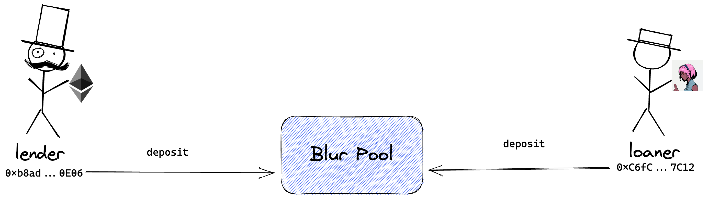
		- 如果是购买（出价）抵押品，可以不用预先充值
	- 贷款报价和抵押凭证离线（链下）保存
		- 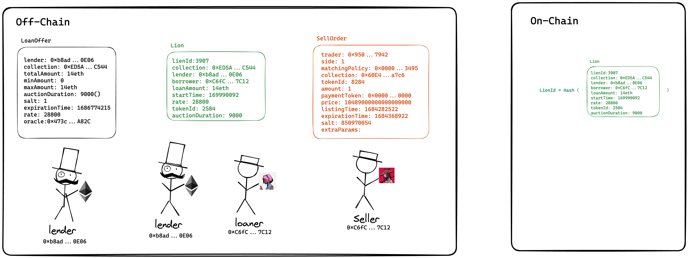 
- ## 正常借款
	- 放贷人先发布 LoanOffer，表示自己愿意的最高出价范围，并保存在 Blur 的服务器中
		- 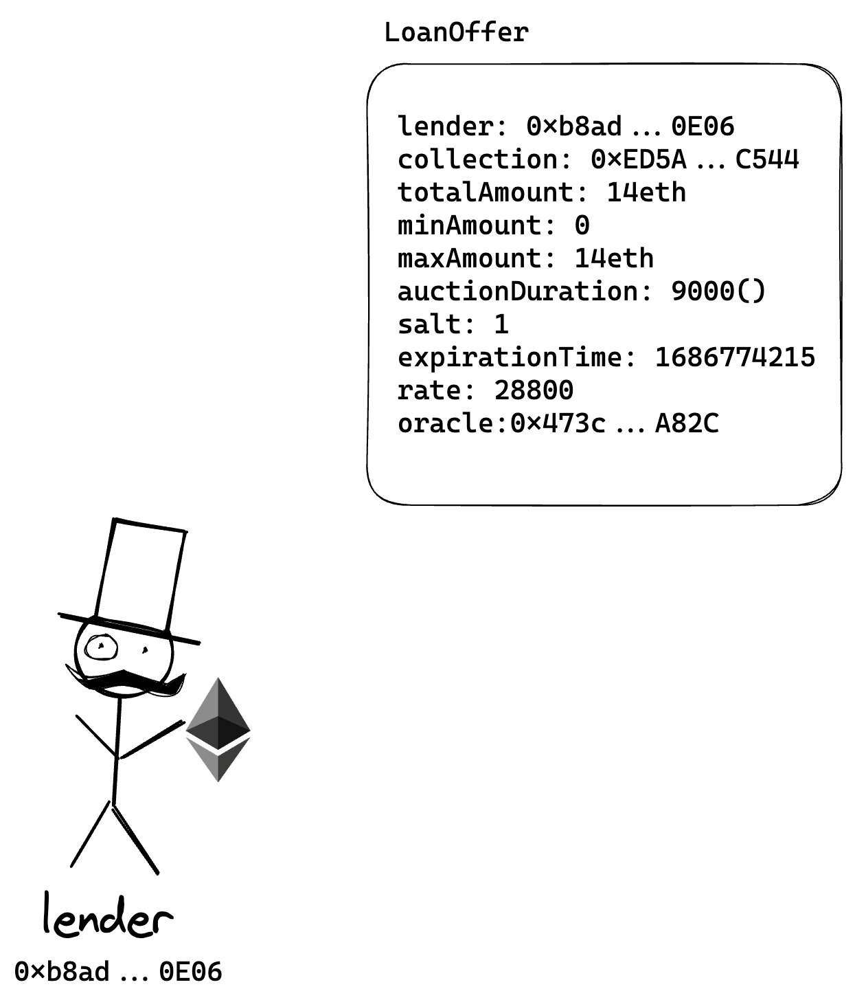{:width 351, :height 461}
		- ```solidity
		  
		  struct LoanOffer {
		      address lender; // 出借人
		      ERC721 collection; // ERC721合约地址
		      uint256 totalAmount; // 总数
		      uint256 minAmount; // 最小数
		      uint256 maxAmount; // 最大数
		      uint256 auctionDuration; // 拍卖持续时间
		      uint256 salt; // 唯一值，用于 offer 的取消
		      uint256 expirationTime; // 过期时间，
		      uint256 rate; // 利率
		      address oracle; // 预言机（作用同 Blur Exchange）
		  }
		   
		  struct LoanInput {
		      LoanOffer offer; // 贷款出价
		      bytes signature; // 签名
		  }
		  ```
	- 借款人从页面中浏览 loanOffer ， 输入借入的金额，并调用合约的 borrow 方法
		- 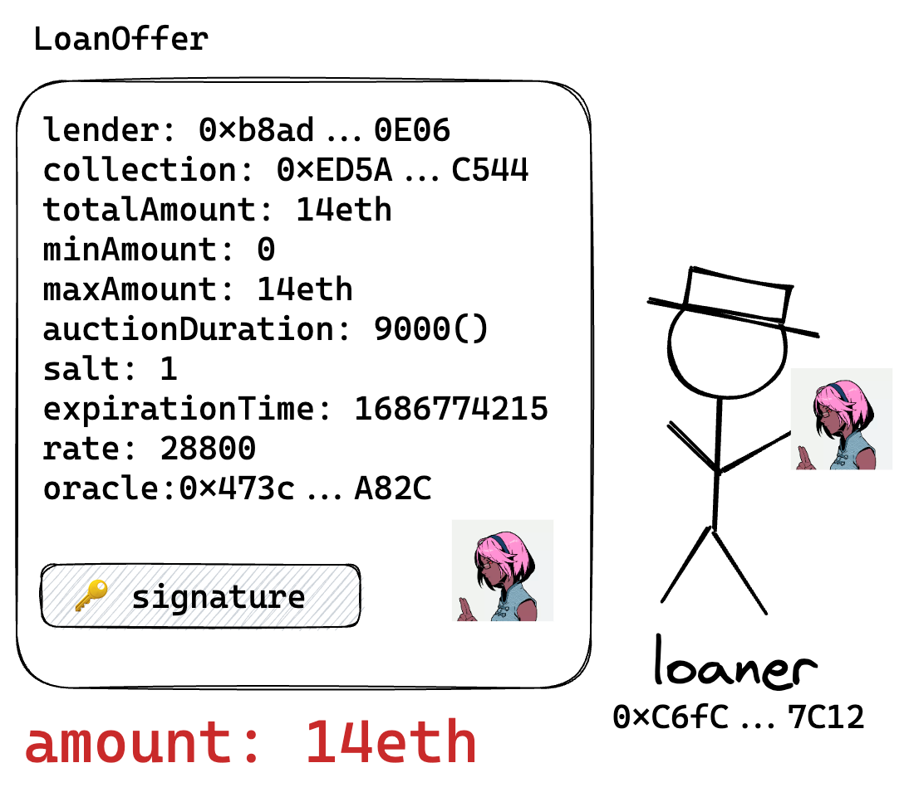{:width 300}
	- 合约锁定 NFT，从 pool 转移 eth 给 loaner，并生成 lion （留置权）
		- 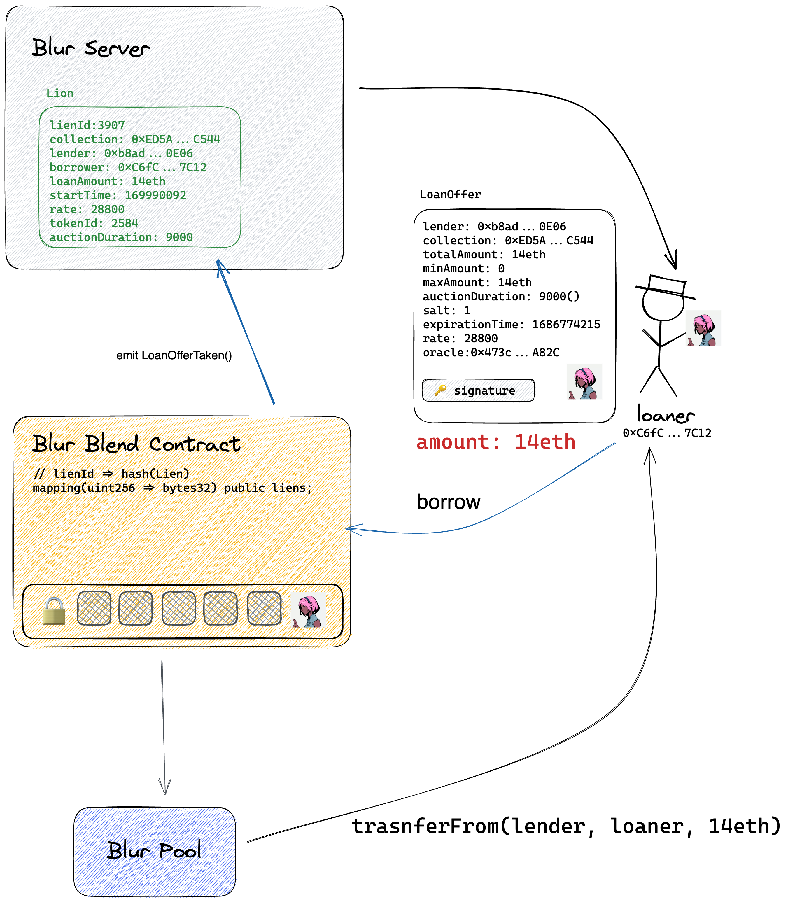{:width 385, :height 392}
		- ```solidity
		  
		  struct Lien {
		      address lender; // 放贷人
		      address borrower; // 借款人
		      ERC721 collection; // ERC721合约地址
		      uint256 tokenId; // ERC721 token id
		      uint256 amount;     // ETH 计价的贷款金额
		      uint256 startTime; // 开始时间
		      uint256 rate; // 利率
		      uint256 auctionStartBlock; // 拍卖开始区块
		      uint256 auctionDuration; // 拍卖持续时间
		  }
		  ```
- ## 正常还款
	- 在清算之前，借款人都可以进行还款，还款后，留置权就会被销毁
	- 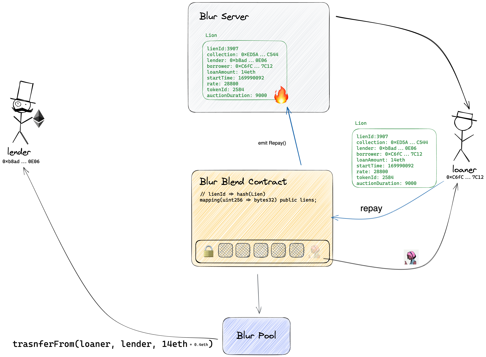{:width 400}
	-
- ## 拍卖阶段
	- 如果放贷人想要拿回贷款，有两种选择：
		- ### 再融资
			- 当市场行情好的时候，放贷人可以选择更低利率的 LoanOffer ，调用合约的 refinance 方法进行再融资
				- 市场行情好 => 抵押物（NFT）价值上升  =>贷款金额不变  =>降低利率出手
				- 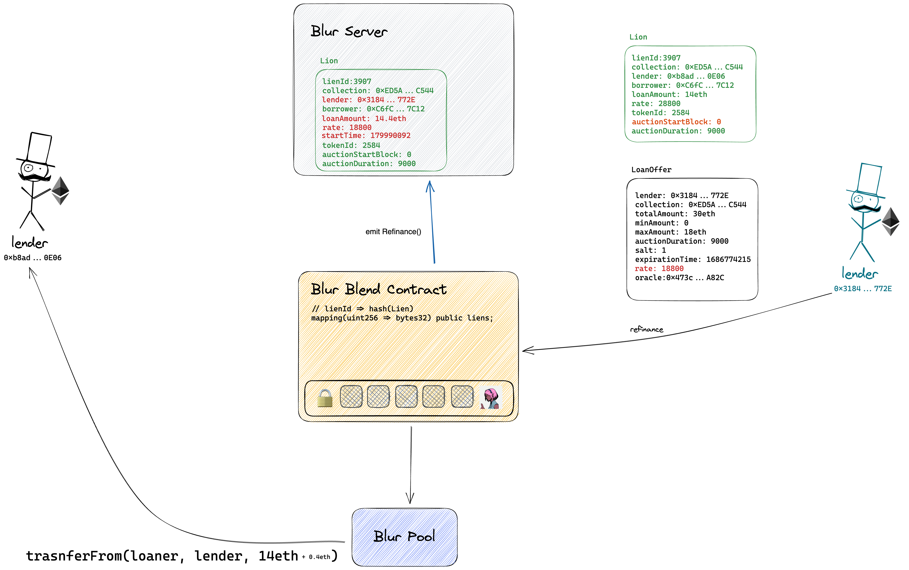
		- ### 拍卖
			- 当 NFT 市场行情下行的时候，放贷人可以选择启用拍卖流程
				- 市场行情不好 => 抵押物（NFT）价值下升  =>贷款金额不变  =>提高利率才有人接手
			- 首先，放贷人调用需要 **startAuction **开启拍卖流程
				- 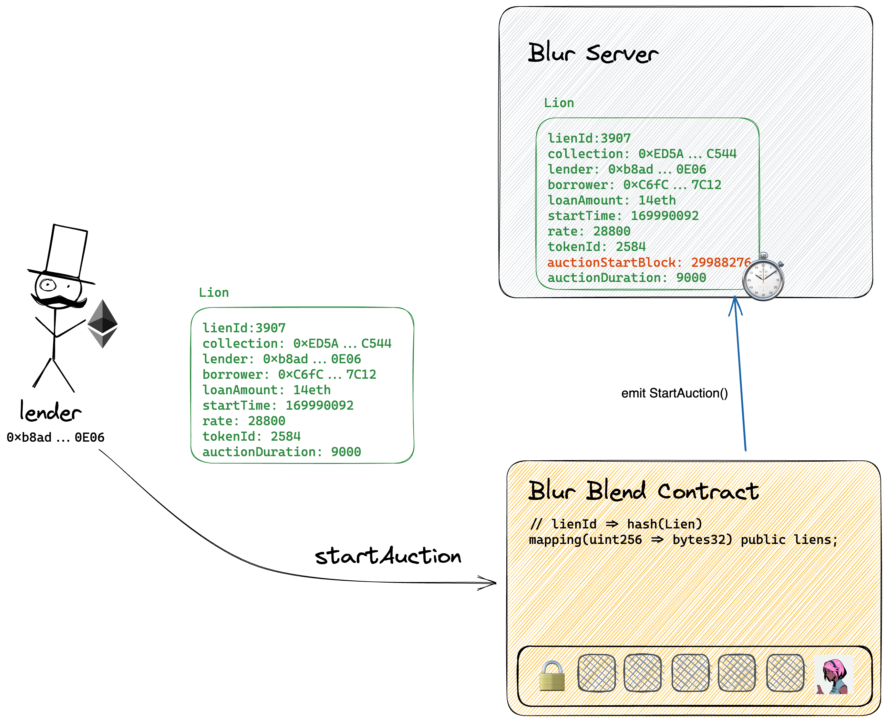
			- 之后，借款人和其他放贷人都可以参与竞拍
				- 借款人可以借新还旧的方式偿还旧贷款，新贷款的金额如果超出或少于旧贷款，借款人需要多退少补
					- 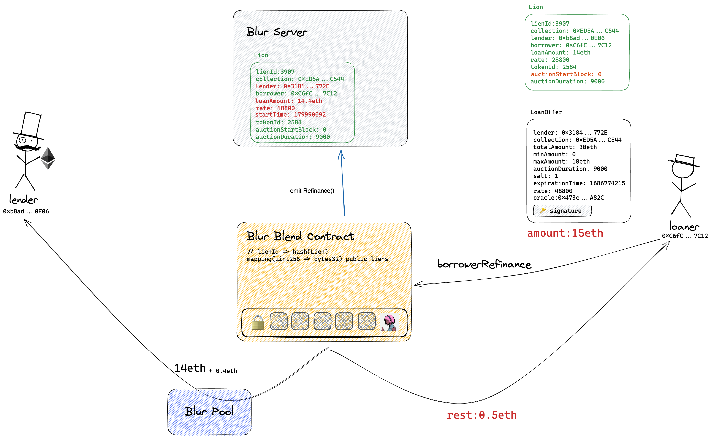
				- 其他放贷人有两种参与方法参与竞拍
					- 直接报价：其他放贷人可以出更高利率的报价，但是利率必须低于 rateLimit。利率限制是随时间（区块）逐步增加，如果没人竞拍，最高到 1000%
						- 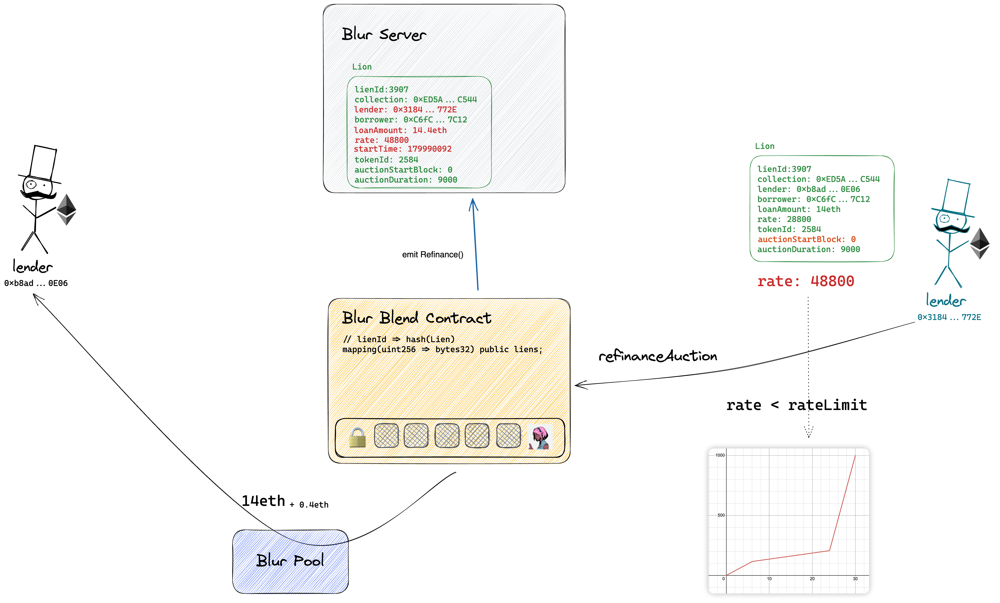{:height 367, :width 594}
					- 第三方撮合：利率限制同直接报价，只不过调用方不同
						- 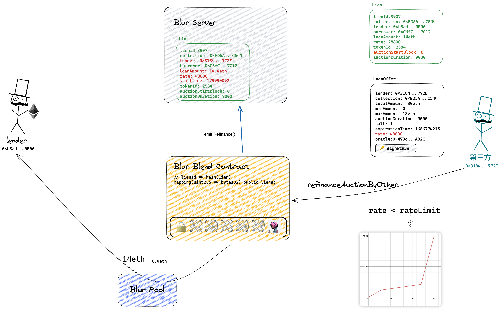
				- 如果过了 auctionDuration 个区块还没有接手，放贷人可以选择清算，扣押该资产
					- 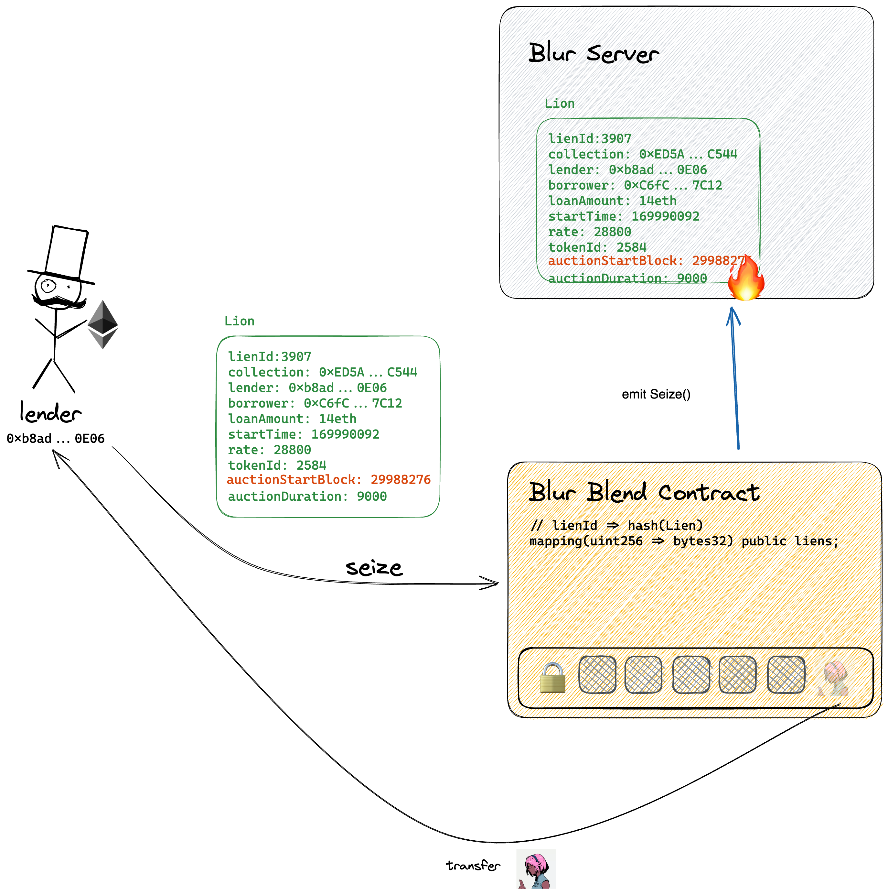
- ## 交易相关方法
	- Blend 除了借款，还提供了交易相关的功能
	- ### 先买后付（Buy Now Pay Later (BNPL) ）
		- BNPL 给 NFT 买卖提供了贷款购买 NFT 的机会，买家可以利用市场现有的 LoanOffer 单和 SellOrder 进行撮合
			- 如果贷款金额小于 SellOrder 的报价，Buyer 需要补足差额，这个过程相当于 **首付购**
			- 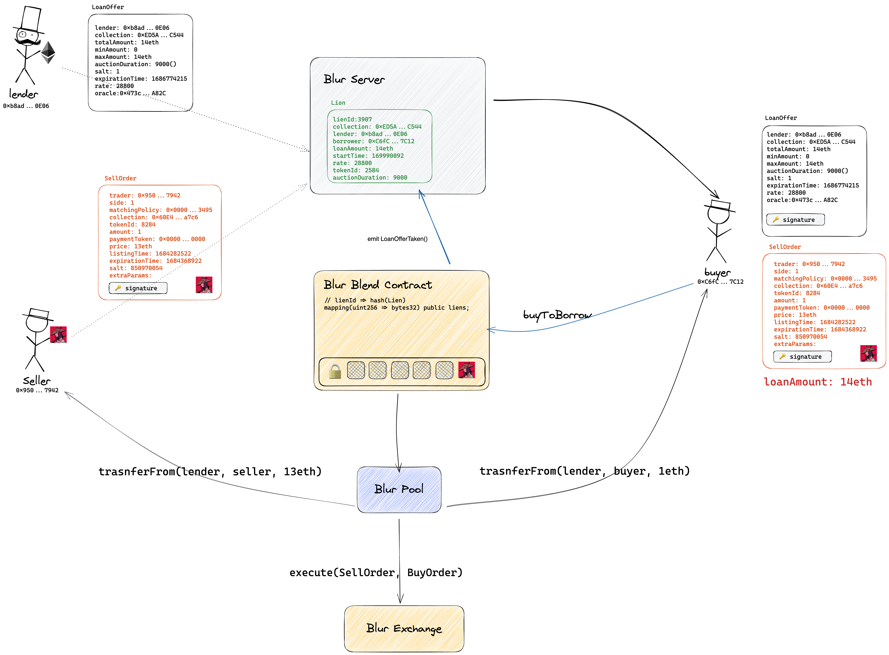
	- ### 带押出售
		- BNPL 给 NFT 卖家也提供了出售抵押品的机会，卖家可以带押提 SellOfer 单
		- 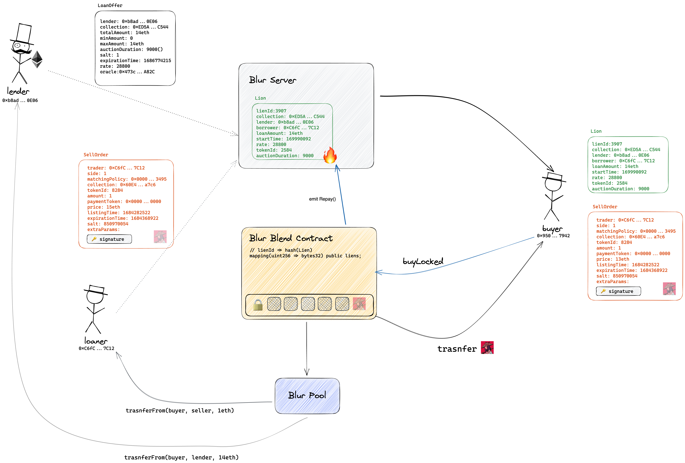
- # 合约架构
	- 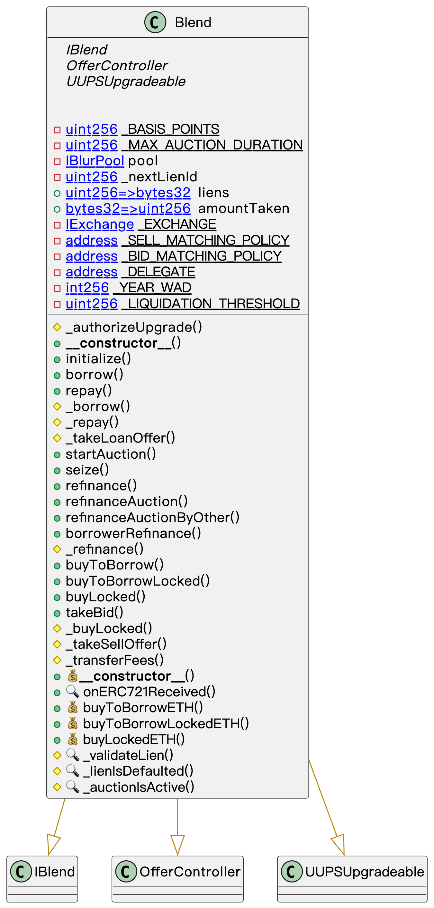{:width 400}
		-
- # 总结
	- 业务流程和合约代码简洁干练，和 Blur Exchange 类似，专注于核心功能
	- 舍弃 Oracle 定价，将定价权和利率的决定权都交给市场，让市场进行调节，整个模式更加灵活
	- 整合了 Blur Exchange ，提供了抵押品交易和先买后付，提高了 NFT 的流动性
	- 缺点：
		- 这是对放贷人友好，对借款人不友好的协议设计。 对借款人来说，因为贷款人可任何时候发起“再融资” 借款人需要为这个贷款人的“选择权”支付更高的代价
- # 代码
	-