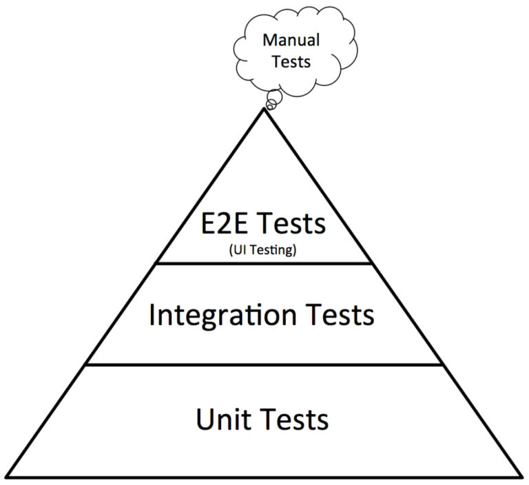

icon:: ⛓

- # Basic
  collapsed:: true
	- #[[Blockchain 基本概念]]
	- #[[以太坊原理详解]]
	- 工具链
	  collapsed:: true
		- truffle
		- hardhat
		- foundry
	- Storage
	  collapsed:: true
		- #什么是去中心化存储？
		- IPFS
		- Arweave
	- Data analysis
	  collapsed:: true
		- Dune
	- Cryptograph
	  collapsed:: true
		- #《图解密码技术-第三版》
	- Consens Protocol
	  collapsed:: true
		- #共识机制和协议汇总
	- Blockchain Interoperability
	  collapsed:: true
		- Cross Chain
		- Layer2
		- Side Chain
	- Layer 1
	  collapsed:: true
		- Sui Network
- # Smart Contract
  collapsed:: true
	- Solidity
	  collapsed:: true
		- #Solidity常见问题集
		- #[[Solidity Tips 集]]
		- #Solidity语法
		- #Memory
		- #storage
		- #[[calldata]]
	- Move
	  collapsed:: true
		- Sui Move
		  collapsed:: true
			- #[[How Sui Move differs from Core Move]]
	- Rust
	- Go
	  collapsed:: true
		- geth
		- crypto
- # dApps
	- ## 模式
		- ### DeFi
		- ### NFTs
		- ### DAOs
		-
	- ## 开发
		- ### Go
		-
	- ## 测试
		- ### 测试金字塔
			- {:height 170, :width 268}
			- #### Uint Test
				- [sol-coverage](https://www.npmjs.com/package/@0x/sol-coverage)
			- #### Integration Test
			- #### End-to-End Test
				- [Make the tests feel the user's pain - E2E testing for DApps · Devcon Archive: Ethereum Developer Conference](https://archive.devcon.org/archive/watch/5/make-the-tests-feel-the-users-pain-e2e-testing-for-dapps/?tab=YouTube)
				- [Puppeteer | Puppeteer (pptr.dev)](https://pptr.dev/)
				- [MetaMask/test-dapp: The sample dapp used for e2e testing and metamask-extension QA (github.com)](https://github.com/MetaMask/test-dapp)
		- ### 相关工具
			- [[水龙头]]
	- ## 运维
		- ### 节点及服务
			- Alchemy
			- Infura
			- Quicnode
			- Cosmos
	- ## 架构
		- TODO 梳理架构
			- [The Architecture of a Web 3.0 application (preethikasireddy.com)](https://www.preethikasireddy.com/post/the-architecture-of-a-web-3-0-application)
			- [Blockchain Development Lecture 6: Dapp Architecture (youtube.com)](https://www.youtube.com/watch?v=KBSq8-LnUDI&t=286s)
	- ## 安全
		- 智能合约的安全性
			- 数据隐私
				- 任何人都可以访问合约中的状态，即使声明为 private 的状态变量。为了在隐私需要保护的场景下，可以使用 commit-reveal 模式，或者零知识证明，详见
			- 随机数
			- 函数可见性
			- Gas 限制
		- 数据泄露
		-
	-
- # 以太坊基础协议
  collapsed:: true
	- #EIP-712元交易（meta-transactions)
	- #[[账户抽象（Account Abstraction）]]
-
- Defi
  collapsed:: true
	- 稳定币和去中心化储蓄
	  collapsed:: true
		- MakerDao
	- 借贷
	  collapsed:: true
		- Compound
		- Aave
		- dYdX
		- LoanScan (聚合器)
	- 交易
	  collapsed:: true
		- [[Uniswap 原理]]
		- Curve
	- 预测市场
	  collapsed:: true
		- Augur
	- 合成资产
	  collapsed:: true
		- Synthetix
- NFT
  collapsed:: true
	- Marketplace
	  collapsed:: true
		- OpenSea
		- OpenSea Pro
		- Blur
		- Looksrare
		- Exchange protocols
		  collapsed:: true
			- Seaport
			- BlurExchange
	- NFTFi
	  collapsed:: true
		- Load
		  collapsed:: true
			- Paraspace
			- BendDAO
			- Blend
		- Staking
		  collapsed:: true
			- Sanbox
			- Ape Staking
	- Project
	  collapsed:: true
		- BAYC
		- Azuki
	- Protocol
	  collapsed:: true
		- #[[NFT 协议栈]]
- DAO
- ZK
- Security
  collapsed:: true
	- #区块链安全集
	- Tools
	  collapsed:: true
		- Slither
		- Mythril
		- Securify
- FE
  collapsed:: true
	- framework
	  collapsed:: true
		- 基础库
		  collapsed:: true
			- ethersjs
			- web3js
		- 全能
		  collapsed:: true
			- [viem · TypeScript Interface for Ethereum](https://viem.sh/)
	- Wallet Connector
	  collapsed:: true
		- [RainbowKit](https://www.rainbowkit.com/zh-CN)
		-
- BE
  collapsed:: true
	- geth
- Read
  collapsed:: true
	- #[[How to DeFi]]
- 工具
  collapsed:: true
	- solidity 静态分析工具
	  collapsed:: true
		- [Ackee-Blockchain/wake: Wake is a Python-based Solidity development and testing framework with built-in vulnerability detectors (github.com)](https://github.com/Ackee-Blockchain/wake)
		-