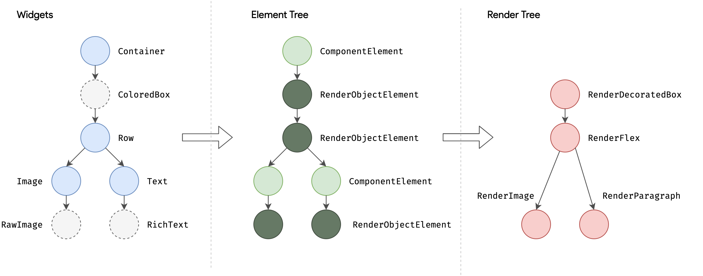
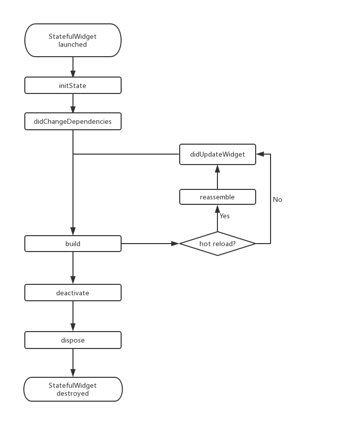

# Widget
	- 构成UI 的基本概念
		- 四棵树：Widget tree -> Element Tree-> RenderObject Tree ->  Layer Tree
		- 
	- ## StatelessWidget
		- 构造函数是 const
			- ```dart
			  const Echo({
			      Key? key,  
			      required this.text,
			      this.backgroundColor = Colors.grey, //默认为灰色
			    }):super(key:key);	
			   
			  ```
		- 属性应该被声明为 final
			- ```dart
			  final String text;
			  final Color backgroundColor;
			  ```
		- build 同react 中的 render）
			- ```dart
			  Widget build(BuildContext context) {
			    return Echo(text: "hello world");
			  }
			  ```
		-
	- ## StatefulWidget
		- 有状态的组件
		- `createState` 相当于工厂方法，当 widget 插入的 UI 中时，为每一个 widget 生成一个 State
		- ### State
			- 配合StatefulWidget 使用
		- ### 生命周期
			- 
-