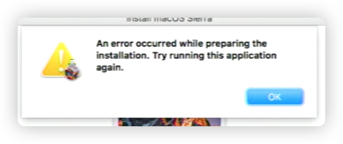

- [[FIXED] macOS Sierra "An error occurred while preparing the installation." Error. Sierra Recovery is Broken! (mrmacintosh.com)](https://mrmacintosh.com/fixed-an-error-occurred-while-preparing-the-installation-macos-sierra-recovery-error/)
- 现象：
	- {:height 186, :width 511}
- 原因：安装包中的 `InstallESD.dmg` 文件出错，导致安装失败
- ```
  *
  Mr.Macintosh's macOS Sierra Command R Recovery & Interent Recovery Fix Date: 02/29/24
  *
  NOTE: You can cut and paste commands directly from this document by highlighting the line with your mouse and then using copy and paste (Command C & Command V).
  *
  What is the PROBLEM? = The InstallESD.dmg located in Apple's macOS Sierra 10.12.6 Internet recovery & App Store is corrupted (and or additional issues), preventing install
  The error message after Siera is downloaded = "An error occurred while preparing the installation try running this application again"
  This is NOT the date & time issue. If you change the date back in time you will fail the PROPER cert check on install.
  Make sure you are connected to WIFI or Ethernet and verify your date and time is correct.
  Following commands are to be run after you BACKUP YOUR DATA if you have not already.
  We need to erase your Hard Drive and name it "Macintosh HD" in disk utility
  The only official working Apple Sierra full installer is "InstallOS.dmg" located at https://support.apple.com/en-us/102662
  The easiest way to work around this issue is to create a macOS Sierra USB installer OR boot to a newer or older version of Internet Recovery
  https://support.apple.com/guide/mac-help/use-macos-recovery-on-an-intel-based-mac-mchl338cf9a8
  NOTE: High Sierra Internet Recovery is also Broke! https://mrmacintosh.com/how-to-fix-the-recovery-server-could-not-be-contacted-error-high-sierra-recovery-is-still-online-but-broken/ 
  Most people only have one Mac & you might be in this situation because your Macintosh HD was already erased & the Siera install failed! so you are STUCK!
  This workaround will help get the working macOS Sierra full installer downloaded from Apple and then we can start it up.
  OPTIONAL at the end, I will also show you how to create a macOS Sierra USB installer inside macOS Recovery just in case.
  
  Let's get started!
  Run each command one at a time.
  
  *Check date & time to make sure it is correct
  date
  
  *If not correct make sure you are connected to wifi or ethernet and run this command
  ntpdate -u time.apple.com
  
  *Change directory to Macintosh HD
  cd /Volumes/Macintosh\ HD
  
  *Download the macOS Sierra 10.12.6 InstallOS.dmg from Apple.com using curl. Note this is a 4.7GB file and might take a while or fail. If it fails run it again.
  curl http://updates-http.cdn-apple.com/2019/cert/061-39476-20191023-48f365f4-0015-4c41-9f44-39d3d2aca067/InstallOS.dmg -o InstallOS.dmg
  
  *We need to mount the InstallOS.dmg
  hdiutil attach InstallOS.dmg
  
  *Now we need to install the "Install macOS Sierra.app" from the InstallOS.dmg to Macintosh HD volume
  installer -pkg /Volumes/Install\ macOS/InstallOS.pkg  -target /Volumes/Macintosh\ HD
  
  *The Install macOS Sierra.app is now in the /Volumes/Macintosh\ HD/Applications folder. We can now start the Sierra installer! 
  /Volumes/Macintosh\ HD/Applications/Install\ macOS\ Sierra.app/Contents/MacOS/Installassistant_springboard
  
  *In a few seconds the Sierra installer will start BEHIND the terminal window.
  *If you don't see it make the terminal window but DON'T close it as it will stop the installer.
  *Now step through the installer you are good to go now!
  
  ***Optional Create macOS Sierra USB installer while we are here. Take a picture of these instructions with your phone as we need to close terminal.
  
  *Plug in your USB Drive and make sure to backup all data as we are going to ERASE the dive in disk utility 
  *When erasing the USB drive, make sure you click "view" and click "Show all devices"
  *Make sure to use Format the USB Drive with macOS Extended Journaled and GUID Partition map. Leave Untitled as the default drive name
  *Go back to terminal
  
  *Even though Apple reissued the Sierra installer to fix the Certificate issue in 2019 it has another problem.
  *The Info.plist CFBundleShortVersionString has an incorrect entry of 12.6.06 it needs to be 12.6.03
  *To fix it we can run this command to edit the new entry in. (Credit MacRumors forum user: EricFromCanada)
  
  plutil -replace CFBundleShortVersionString -string "12.6.03" /Volumes/Macintosh\ HD/Applications/Install\ macOS\ Sierra.app/Contents/Info.plist
  
  *Now we can create the macOS Sierra USB Installer!
  /Volumes/Macintosh\ HD/Applications/Install\ macOS\ Sierra.app/Contents/Resources/createinstallmedia --volume /Volumes/Untitled --applicationpath /Volumes/Macintosh\ HD/Applications/Install\ macOS\ Sierra.app
  
  I hope these instructions helped you get your Mac back up and running.
  Mr. Macinitosh.
  *
  ```