title:: Solana #1 Overview
:LOGBOOK:
CLOCK: [2022-09-26 Mon 11:54:01]--[2022-09-26 Mon 11:54:01] =>  00:00:00
:END:
type:: overview

-
- # Solana 是什么？
- 一段话概括：Solana 是开源的，具有**分布式**、**免信任**、**高性能**区块链项目项目，原生代币为 SOL，采用历史证明（PoH）的共识机制
- | **公链** | **代币** | **每秒交易量（TPS）** | **平均交易手续费(USD)** | **交易延迟时间** | **验证节点数量** | **交易量** |
  | Solana | SOL | 65,000 | 0.0015 | 0.4 sec | 702 | [$85,640,853,017](https://coinmarketcap.com/currencies/solana/markets/) |
  | Etherum | ETH | 15 | 15 | ~5mins | 11,000+ | [$479,789,020,954](https://coinmarketcap.com/currencies/ethereum/markets/) |
  | Polkadot | DOT | 1,000 | 1 | 2mins | 297 | [$30,890,483,920](https://coinmarketcap.com/currencies/polkadot-new/markets/) |
  | Cardano | ADA | 270 | 0.25 | 10mins | 2,376 | [$45,591,852,164](https://coinmarketcap.com/currencies/cardano/markets/) |
  | Tron | TRX | 2000 | 0.069 | 1min | 1124 | [$29,381,719,408](https://coinmarketcap.com/currencies/tron/markets/) |
  | Ripple | XRP | 1500 | 0.00007 | 3-5 seconds | 70 | [$65,583,412,623](https://coinmarketcap.com/currencies/xrp/markets/) |
  | Avalanche | AVAX | 5,000+ | 5% | few seconds | 650+ | [$62,293,712,571](https://coinmarketcap.com/currencies/avalanche/markets/) |
- 数据来源[CoinMarketCap](https://coinmarketcap.com/) (2022/3/31)
-
- # 公链技术
  :LOGBOOK:
  CLOCK: [2022-09-26 Mon 14:33:13]
  :END:
- 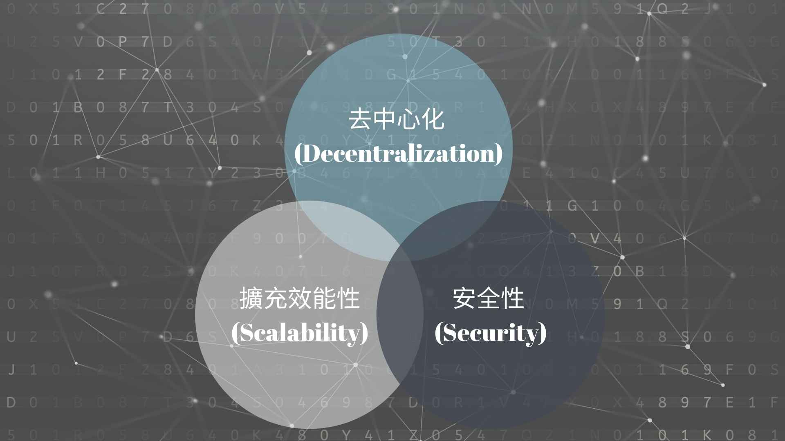
- 区块链技术存在“不可能三角”，即无法同时达到可扩展（Scalability）、去中心化（Decentralization）、安全（Security），三者只能得其二。
- 区块链的“不可能三角”并不是经过严格论证而得出的结论，它只是对各公链实际运行状况作出的总结，为研究公链技术提供一个思维框架。实际上，ETH 2.0 正在打破不可能三角。
- **区块链扩容方案**
	- block size
	- off-chain
		- state channel
		- side chain
		- Plasma
	- layer2
	- 共识机制
		- PoS：Avalanche、Polygon、BSC、**Sonala**
		- DPoS：EOS
-
- # Sonala 的背景
- Solana 由 FTX 交易所创始人SamBankman Fried 发起
	- 2017白皮书
	- 2018测试网
	- 2020年3月上线Mainnet Beta（100%功能）
	- 2022年上线主网
- 特点
	- 最快的 L1 公链
	- 400毫秒出块时间
	- 每秒处理50000笔交易
- 生态
	- 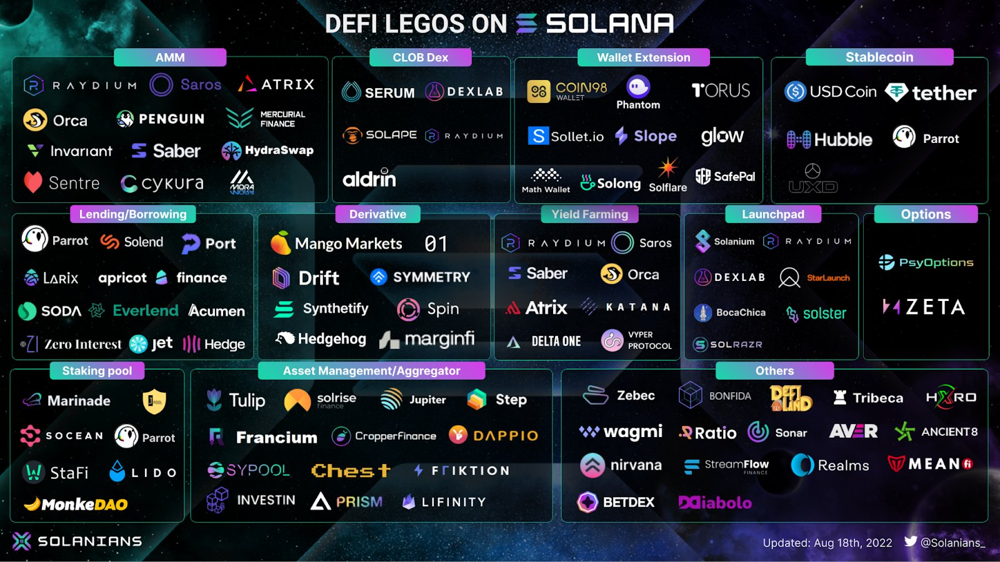{:height 284, :width 491}
	- [Ecosystem | Solana: Build crypto apps that scale](https://solana.com/zh/ecosystem)
-
- # 生态
	- ## Magic Eden —— Solana生态的NFT入口
		- 专注于 Solana
			- Magic Eden 当前已然是 Solana 上最大的 NFT 交易市场
		- 专注于用户
			- Magic Eden 也为一些不太熟悉技术的创作者们提供了一个操作简单的 NFT 铸造窗口，艺术家们可通过 Magic Eden 完成自身作品的 Launchpad，从而获得 Solana 之上最大的市场曝光量，对接至更多的买家。
			- Sweeps 扫货
			- Mobile App
		- 开放性
			- 开放生态：在 Solana 之上使用 Magic Eden 构建自身 NFT 市场
			- 游戏赋能：Eden Games，Solana 上 90% 的游戏 NFT 交易量都发生在 Magic Eden 上
			- MagicDAO： 社区治理
		- 多样性
			- 9月份支持以太坊，通过聚合器整合OpenSea、LooksRare、X2Y2、Rarible
			-
	- ## STEPN —— Move To Earn
		- 该游戏基于 Solana 区块链构建，号称全球首款 Move To Earn（边运动边赚）NFT 游戏。
		- 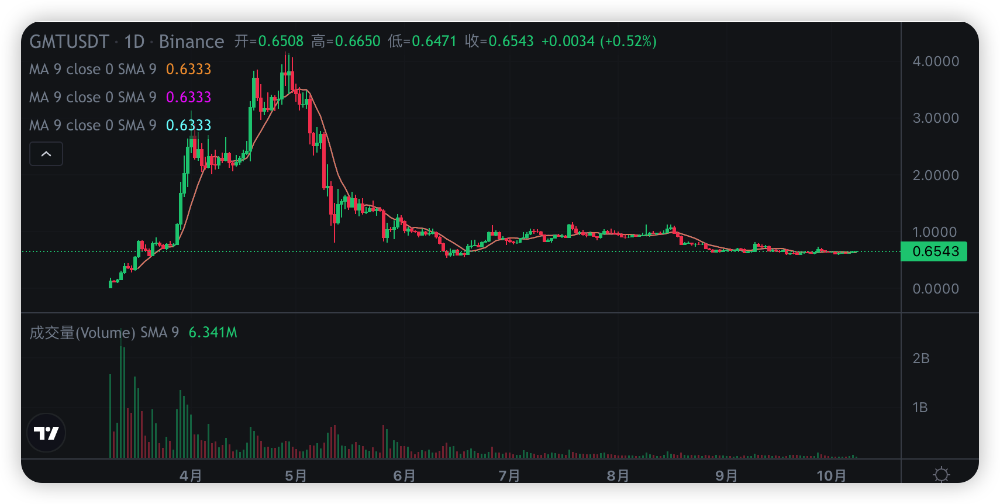
		- 22 年 1 月份红杉资本印度领投、binance launchpad 上线 GMT
		- 在 5 月份达到顶峰时，STEPN 占 Solana 总用户的 20%。结合其巨额收入，让加密游戏获得巨大关注和支持；
		- 在熊市背景和**庞氏死亡螺旋**的影响下，STEPN 逐渐没落
		-
-
- # 核心创新
	- **Proof of History (POH)**— a clock before consensus
	- **Tower BFT** — a PoH-optimized version of PBFT
	- **Turbine** — a block propagation protocol
	- Gulf Stream — Mempool-less transaction forwarding protocol;
	- Sealevel — Parallel smart contracts run-time
	- Pipelining — a Transaction Processing Unit for validation optimization
	- Cloudbreak — Horizontally-Scaled Accounts Database
	- Replicators — Distributed ledger store
- # 如何运作
	- 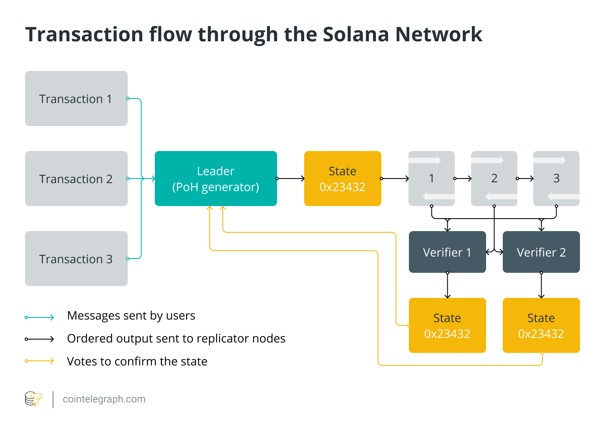
		- 1. 向 Leader 节点输入交易
		  2. Leader 将交易按照”时间“排序，并对交易进行处理
		  3. Leader 按照内存中的当前状态执行交易
		  4. Leader 将交易、最终状态和签名发给 verifiers
		  5. verifiers 在其状态副本上执行相同的交易，并进行确认，确认后发布状态签名
		  6. 已发布的确认将作为共识算法的投票
		- ### Leader
			- 某一确定的时刻，只有一个 Leader 节点
			- 生成 PoH 时间流，向全网提供一个具有一致性，可验证的时间过程
			- 将交易绑定到 PoH 时间流
		- ### Verifies
			- 执行状态副本，并广播最终的交易状态的签名
			- 广播的签名作为共识算法的投票
			- 每个 Verifier 都拥有和 Leader 同样的硬件能力，可以基于 PoS 被选举为 Leader
	- ## 共识机制
		- ## Proof of History（PoH）
			- POH是通过创建历史记录的方式，实现一个全局可以用的时钟
				- 1. 通过SHA256之类的Hash加密函数，来计算生成序列，提供验证两个事件（这里可以理解为两个区块生成）之间的时间流逝。
				  2. 创世区块中，第一笔交易Hash函数的输入是一个随机值，然后该函数的输出，将是下一次Hash函数计算的输入参数之一：
				- 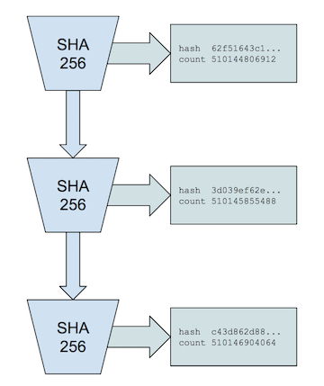、
				- 3. 将外部事件的时间戳囊括进来
				  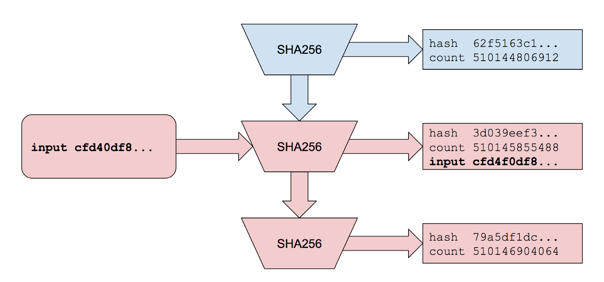 
				  5.证明所生成的历史证明
				- 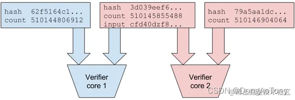
				- 6. 如何保证一致性
				- 当存在恶意的PoH Generator，可能会生成与正常序列不一致的序列：
					- | PoH Generator A |  |  | PoH Generator B |  |  |
					  | Index | Data | Output Hash | Index | Data | Output Hash |
					  | 10 |  | hash10a | 10 |  | hash10b |
					  | 20 | Event1 | hash20a | 20 | Event3 | hash20b |
					  | 30 | Event2 | hash30a | 30 | Event2 | hash30b |
					  | 40 | Event3 | hash40a | 40 | Event1 | hash40b |
				- 客户端会把它所认可的最新的序列的Hash，与它的event绑定，生成新的Event，而用这个Event来作为此次Hash生成的输入参数之一。
					- | PoH Generator A |  |  |
					  | Index | Data | Output Hash |
					  | 10 |  | hash10a |
					  | 20 |  | hash20a |
					  | 30 |  | hash30a |
					  | 40 |  | hash40a |
				- 加入 Event 签名，防止恶意Generator拿到了用户原始内容event
					- | PoH Generator A  |  |  |
					  | Index | Data | Output Hash |
					  | 10 |  | hash10a |
					  | 20 | Event1 = sign(append(event1 data, hash10a), Client Private Key) | hash20a |
					  | 30 | Event2 = sign(append(event2 data, hash20a), Client Private Key) | hash30a |
					  | 40 | Event3 = sign(append(event3 data, hash30a), Client Private Key) | hash40a |
				- 最终的过程
					- 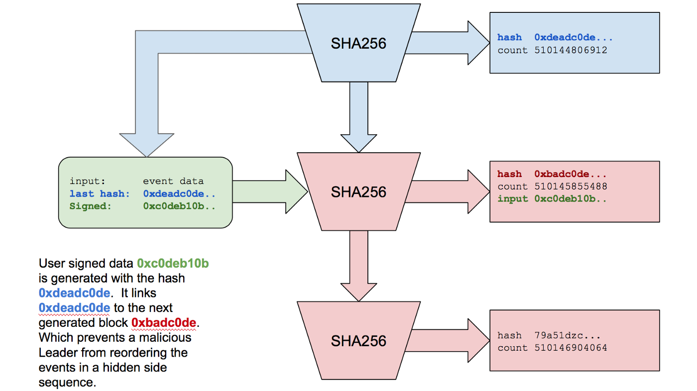
					-
		- ## Tower BFT
			- 基于PoH的共识算法
			- 在历史证明之上，Solana 运行Tower 共识，这是一种类似 PBFT 的共识算法，专门设计用于同步时钟。
			- 拜占庭算法/拜占庭容错（BFT Byzantine Fault Tolerance）——解决**拜占庭将军问题** 的算法
				- 在区块链领域中，拜占庭将军问题可以归纳为：假设网络中有 N 个节点，此时需要验证一条信息在全网是否有效。有一个算法（ BFT）可以验证这条信息在半数以上的节点是一致的
			- 实用拜占庭算法（PBFT）
				- 1. 客户端发送请求给主节点
				  2. 主节点广播请求给其它节点，节点执行PBFT算法的三阶段共识流程。
				  3. 节点处理完三阶段流程后，返回消息给客户端。
				  4. 客户端收到来自 f+1 个节点的相同消息后，代表共识已经正确完成。
				- 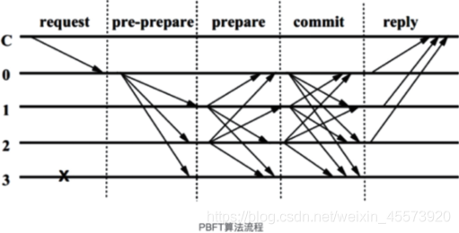
			- TBFT
				-
		- ## Turbine
			- 高性能区块链的挑战之一是网络如何将大量的数据传播给大量的对等（peer）节点
			-
	- ## 编程模型
		- **app** 通过 **transactions** 携带 **instructions** 来与 **Solana 集群**中的 **programs** 交互。 **programs** 事先由开发者上传到集群中。
		-
		- ### Accounts
			- 账户由一个 256-bit 的 public key 表示。
			- 存储状态 State
				- 账户需要定期交租（**rent**），否则会被删除
				- Solana 集群的每个 epoch 是2天的时间，目前的租金费率计算如下：
					- 3.56 SQL/年/Mb = 0.01 SQL /天/Mb = 19.055441478439427 lamport/epoch/byte
				- 一次性付足2年的租金可以永久豁免租金
				- 最大 10MB
			- 签名
				- 账户作为 Signer 给一个 transaction 签名
			- 只读
				- 账户可以被指定为只读状态，可以被多个 transaction 同时执行
			- 可执行
				- 表示账户是一个 program，public key 就是program id
			- 所有权
				- owner这个字段保证了用户对账户的决定拥有权利，如果某一个地址是某一个account的owner，那么那个地址就可以对这个account资产进行转移。所以solana的合约token其实就是solana程序会帮忙生成一个account，然后把owner赋予给你。
			- 账户结构
			- | 字段 | 描述 |
			  | ---- | ---- | ---- |
			  | lamports | 该账户所拥有的SOL原生代币数额（以lamports为单位） |
			  | owner | 该账户的程序owner |
			  | executable | 表明该账户是否可处理instructions |
			  | data | 该账户存储的原始（raw）字节数组 |
			  | rent_epoch | 存储费将要缴纳的epoch |
		- ### Programs
			- 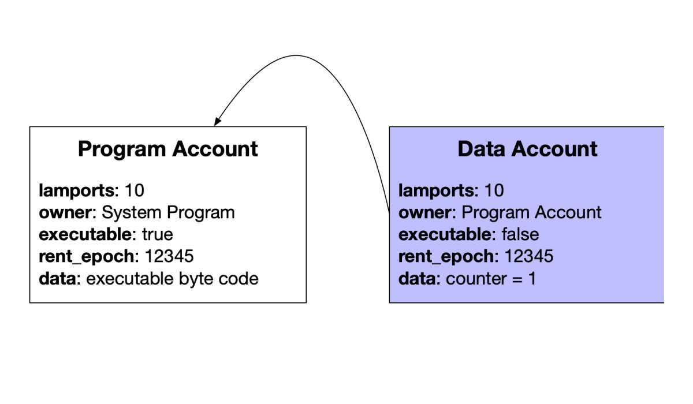{:height 420, :width 706}
			- 通常用 Rust 编写
			- 与大多数其他区块链不同，Solana完全将**代码与数据分离**
			- 类型
				- 原生程序
					- 提供了和 Solana 链交互的基本功能
					- System Program： 创建 accounts、transfer tokens...
					- BPF Loader Program: 部署、升级、执行程序
				- 链上程序（smart contract）
					- Solana 程序库（SPL）
						- 实现了token、Name Service、token swap
					- 不同于以太坊，Solana 的程序是可升级的
			- 如何调用？
				- 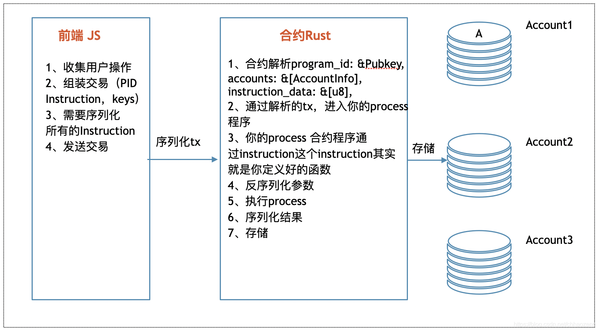
			- 交易费
				- 交易费，用于执行交易 (aka “gas fees”)
				- 存储费，用于在链上存储数据
		- ### Transactions
			- 在 Solana 中，可以将多个**程序**（Program）的**调用**（instructions）组合到一个**交易**（transaction）中，再广播到 Solana 集群中。Solana 集群会**按顺序**执行每个程序的每个指令。
			- 每个交易包括**一系列签名（签名数组）**和**消息体**
				- 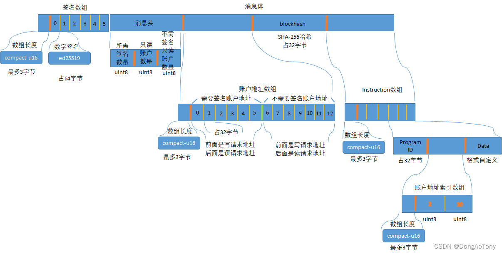
				-
	-
-
- # Solana 的危机
	- 大规模盗币事件
		- 2022 年2月
			- 黑客利用 Solana 在跨链桥的漏洞盗取3.2亿美元 ETH
		- 2022 年 8 月 3日，数千名用户钱包被盗，几百万美元不翼而飞
			- Slope 钱包缺少审计
	- 频繁宕机
		- 2022 年 1 月
			- 6次宕机，最长 48h
		- 2022 年 6 月 停止出块
		- 2022 年 9 月 网络中断
		- 
	- TVL 造假
		- TVL（锁定的总价值）是区块链公司非常重要的重要
		- 2022 年 8 月 5 日
			- Solana 最大的 Defi 项目 Sabre 伪造了 11 个开发者身份，在 TVL 达到 105 亿美元的时候，有数十亿美元的价值被重复计算
			- 这位开发者随后转去了 Aptos
	- Magic Eden
		- 占 NFT 交易量 90% 以上，使用托管的方式管理用户 NFT，过于集中，用户资产容易收到攻击
		- 2021 年 12 月，灰度基金发布了关于 Solana 的分析报告，其中指出 Solana 可能面临安全风险。灰度指出：
			- >Solana 利用多种新技术方法有利也有弊。首先，Solana 共识机制使用了一种未广泛使用的新区块链技术，可能无法按预期运行；其次，网络底层的密码技术可能存在缺陷，包括影响 Solana 网络功能或使网络容易受到攻击的缺陷；最后，Solana 的经济激励措施可能无法按预期发挥作用，这可能会导致网络不安全或表现不佳。
-
- # 总结
	- 
	- Solana 是否达到了不可能三角
		- **去中心化** 低于 ETH
		- **扩展性** 高于 ETH
		- **安全性** 低于 ETH
-
- # 参考文档
- [Shinobi Systems' Solana Proof of Stake + Proof of History Primer (shinobi-systems.com)](https://www.shinobi-systems.com/primer.html)
- [Solana之旅1：Solana是什么_DongAoTony的博客-CSDN博客_solana](https://blog.csdn.net/DongAoTony/article/details/123939291?spm=1001.2014.3001.5502)
- [PBFT基础流程 — FISCO BCOS v2.9.0 文档 (fisco-bcos-documentation.readthedocs.io)](https://fisco-bcos-documentation.readthedocs.io/zh_CN/latest/docs/design/consensus/pbft.html)