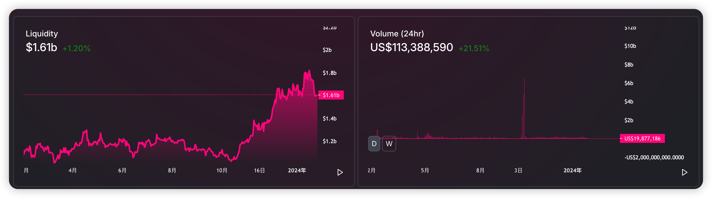
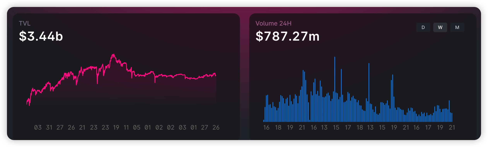
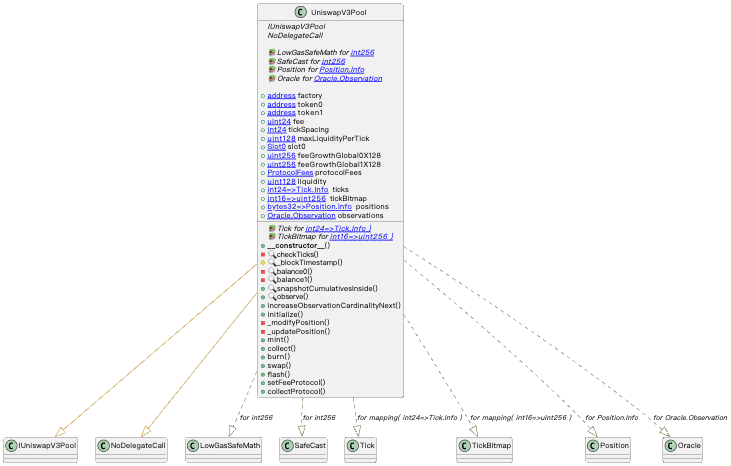

# v2
	- 合约架构
		- Core
			- UniswapV2Pair
				- UniswapV2ERC20：实现了 EIP2612 以支持代币的离线授权
			- UniswapV2Factory
				- 创建交易币对，并提供注册表服务
				- 设置手续费地址
		- Periphery
			- UniswapV2Migrator
			- UniswapV2Router01
	- 核心思想
		- X* Y = k：当一个用户购买资产 A 时，相应的会增加资产 B 的数量，以保持 X * Y = k
			- 增加流动池：K 值增大，曲线向外移动
			- 减少流动性：K值减小，曲线向内移动
	- 创建 Liquidity Pool
		- Factory.createPair(tokenA, tokenB)
			- 用 create2 创建新的 lp 合约，lp 合约本质上是一个 ERC20，该合约会持有 tokenA 和 tokenB
			- 在 factory 内部保存 lp 的引用
			- 此时只是创建 lp 合约，还没有创建流动性
	- 向  Liquidity Pool 添加流动性
		- V2Router02.addLiquidity(tokenA, tokenB, amountADesired  amountBDesired, amountAMin, amountBMin, to, dealine)
			- 如果 lp 不存在，则调用 factory.createPair 创建
			- 计算 amountA 和 amountB，因为 lp 中的储备金可能时刻变化（在添加流动性之前，有其他交易成功），会影响 K 值，从而影响 A B 的比例。所以在 addLiquidity方法中，需要明确明确成功执行时价格的偏差范围，也就是滑点
			- 向 lp 合约转移tokenA 和 tokenB，并mint lp
			- addLiquidityETH 方法同理，会将 ETH 转换为 WETH
	- Swap
	  collapsed:: true
		- router.swapExactTokensForTokens(
		- 手续费
			- 在每次 swap 时，会预留出 0.3% 的手续费，该手续费不会立即分配给 LP，会累积在交易池中
				- ```solidity
				  function getAmountIn(uint amountOut, uint reserveIn, uint reserveOut) internal pure returns (uint amountIn) {
				      require(amountOut > 0, 'UniswapV2Library: INSUFFICIENT_OUTPUT_AMOUNT');
				      require(reserveIn > 0 && reserveOut > 0, 'UniswapV2Library: INSUFFICIENT_LIQUIDITY');
				      uint numerator = reserveIn.mul(amountOut).mul(1000);
				      uint denominator = reserveOut.sub(amountOut).mul(997);
				      amountIn = (numerator / denominator).add(1);
				  }
				  ```
			- lp.swap 中，会验证手续费扣除之后，池子的总财富是增加的
				- ```solidity
				  function swap(uint amount0Out, uint amount1Out, address to, bytes calldata data) external lock {
				      ...
				      { // scope for reserve{0,1}Adjusted, avoids stack too deep errors
				          uint balance0Adjusted = balance0.mul(1000).sub(amount0In.mul(3));
				          uint balance1Adjusted = balance1.mul(1000).sub(amount1In.mul(3));
				          require(balance0Adjusted.mul(balance1Adjusted) >= uint(_reserve0).mul(_reserve1).mul(1000**2), 'UniswapV2: K');
				      }
				      ...
				  }
				  ```
	- 价格预言机
		- v2 采用时间加权平均价格，在同步储备金方法中，会同时计算当前区块下的加权平均价格
		  collapsed:: true
			- ```solidity
			   function _update(uint balance0, uint balance1, uint112 _reserve0, uint112 _reserve1) private {
			        require(balance0 <= uint112(-1) && balance1 <= uint112(-1), 'UniswapV2: OVERFLOW');
			        uint32 blockTimestamp = uint32(block.timestamp % 2**32);
			        uint32 timeElapsed = blockTimestamp - blockTimestampLast; // overflow is desired
			        if (timeElapsed > 0 && _reserve0 != 0 && _reserve1 != 0) {
			            // * never overflows, and + overflow is desired
			            price0CumulativeLast += uint(UQ112x112.encode(_reserve1).uqdiv(_reserve0)) * timeElapsed;
			            price1CumulativeLast += uint(UQ112x112.encode(_reserve0).uqdiv(_reserve1)) * timeElapsed;
			        }
			        reserve0 = uint112(balance0);
			        reserve1 = uint112(balance1);
			        blockTimestampLast = blockTimestamp;
			        emit Sync(reserve0, reserve1);
			    }
			  ```
			- 可以通过 lp 下面的两个方法获取价格
				- ```solidity
				  function price0CumulativeLast() external view returns (uint);
				  function price1CumulativeLast() external view returns (uint);
				  ```
- # TODO v3
	- 特性
		- **集中流动性**：流动性提供者可以将资金集中在一个特定价格区间内，如果当前价格超出这个区间，该 LP 就会被忽略，以避免无常损失
		- **多种手续费**：使得流动性提供者可以在不同的价格区间定义手续费，以便承担不同的风险
		- 对比
			- {{renderer excalidraw, excalidraw-2024-01-26-00-17-31}}
		- 资本效率
		  collapsed:: true
			- v2 最大的一个缺点是资金利用率低，如图所示，每日的成交额只占了总资金的 8%
				- 
			- v3 如图所示，资金利用率 23%
				- 
	- 合约架构
		- ref：[Keegan 小钢 的文章 - 登链社区 (learnblockchain.cn)](https://learnblockchain.cn/people/96)
		- core
		  collapsed:: true
			- **UniswapV3Factory**，负责部署流动性池，管理和控制资金池的费率
				- UniswapV3PoolDeployer，创建 pool 并返回给 factory.createPool ，然后保存到 getPool 状态变量。合约本身很小，但有两个新颖的用法
					- ```solidity
					  // 1. 使用 new 创建合约时，可以指定 salt，简化了 create2 的内联汇编,
					  // ref:https://docs.soliditylang.org/en/v0.8.24/control-structures.html#salted-contract-creations-create2
					  pool = address(new UniswapV3Pool{salt: keccak256(abi.encode(token0, token1, fee))}());
					  
					  
					  // 2. 合约间使用 storage 传参
					  // 合约1
					  parameters = Parameters({factory: factory, token0: token0, token1: token1, fee: fee, tickSpacing: tickSpacing});
					  pool = address(new UniswapV3Pool{salt: keccak256(abi.encode(token0, token1, fee))}());
					  delete parameters;
					  
					  // 合约2
					  (factory, token0, token1, fee, _tickSpacing) = IUniswapV3PoolDeployer(msg.sender).parameters();
					  
					  ```
				- NoDelegateCall，抽象合约，禁止当前合约被其他合约通过 delegatecall 调用
				- tickSpacing, factory 初始定义了三个费率 0.05%、0.3%、1%，每个费率对应了 tick间隔，例如 0.05%，对应 10， 也就是每个 tick 的价格区间间隔10
					- 费率越高 → tickSpacing 越高 → swap 消耗的gas fee 低
			- **UniswapV3Pool**
				- 合约结构
					- 
					-
					- 继承的 library 主要有：
						- LowGasSafeMath：gas 优化过的算术运算
						- SafeCast：更为安全的类型装换，可以将 uint256 转换为 160、128、256
						- Tick：管理 tick
						  TickBitmapk：管理 tick
						  Position：管理头寸
						  Oracle：预言机计算
					- 状态变量
						- ```solidity
						  /// 继承自 IUniswapV3PoolImmutables，这些状态变量无法更改
						  address public immutable override factory;
						  address public immutable override token0;
						  address public immutable override token1;
						  uint24 public immutable override fee;
						  
						  int24 public immutable override tickSpacing;
						  
						  uint128 public immutable override maxLiquidityPerTick; // tick 能接受的最大流动性，在构造函数中计算所得
						  
						  /// 继承自 IUniswapV3PoolState，运行过程中会变更的状态
						  struct Slot0 {
						      uint160 sqrtPriceX96;  // 当前价格，sqrtPriceX96 = (token1数量 / token0数量) ^ 0.5 * 2^96
						      int24 tick; // 当前的tick
						      
						      // 用户计算预言机价格
						      uint16 observationIndex;
						      uint16 observationCardinality;
						      uint16 observationCardinalityNext
						      
						      uint8 feeProtocol; // 协议费率，是 手续费的 1/n
						      bool unlocked; // 重入锁
						  }
						  
						  Slot0 public override slot0;
						  
						  uint256 public override feeGrowthGlobal0X128; // 单位流动性所获得的手续费
						  uint256 public override feeGrowthGlobal1X128;
						  
						  // accumulated protocol fees in token0/token1 units
						  struct ProtocolFees {
						      uint128 token0;
						      uint128 token1;
						  }
						  ProtocolFees public override protocolFees; // 记录了两个 token 的累计未被领取的协议手续费。
						  
						  uint128 public override liquidity;
						  
						  mapping(int24 => Tick.Info) public override ticks;
						  mapping(int16 => uint256) public override tickBitmap;
						  mapping(bytes32 => Position.Info) public override positions;
						  
						  // 用于计算预言机价格
						  Oracle.Observation[65535] public override observations;
						  ```
					- 核心函数
						- **initialize**：初始化 slot0 状态
						- **mint**：添加流动性
						- **collect**：提取手续费收益
						- **burn**：移出流动性
						- **swap**：兑换代币
						- **flash**：闪电贷
						- increaseObservationCardinalityNext： 扩展observations 数组的存储容量
		- periphery
			- **NonfungiblePositionManager**：头寸管理合约
			- **SwapRouter**：兑换路由合约，交易的入口
	- 如何集成 v3
		- [Set Up Your Local Environment | Uniswap](https://docs.uniswap.org/contracts/v3/guides/local-environment)
- # v4
  collapsed:: true
	- 特性
		- **引入 hooks**：是本次版本的最核心的改动，极大扩展了灵活性，可以实现定制化流动性池
			-
		- **单例模式**：v4 之前每个流动性池都是通过 factory 创建的单独合约，v4 改用单例模式，在 PoolManager 中统一管理，减低了创建流动性池时的 gas 消耗
		- **闪电记账**：
		- **支持原生 ETH**：底层支持 ETH 与 token 交易，gas 成本进一步降低
- [剖析 DeFi 交易产品之 UniswapV4：概述篇 | 登链社区 | 区块链技术社区 (learnblockchain.cn)](https://learnblockchain.cn/article/6941)