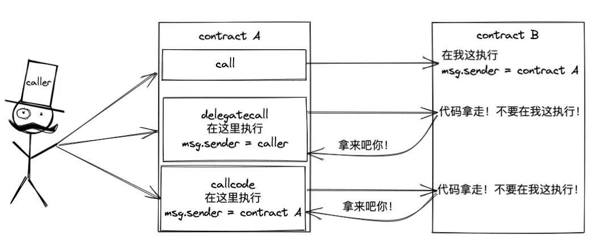
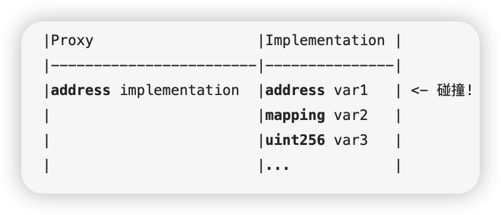
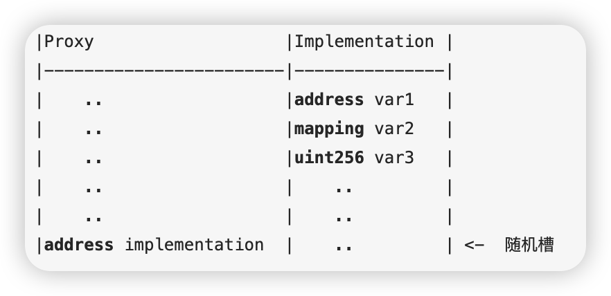
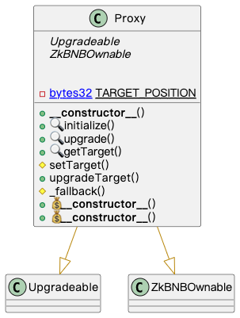
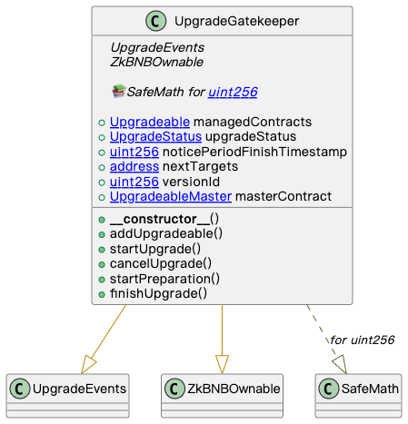
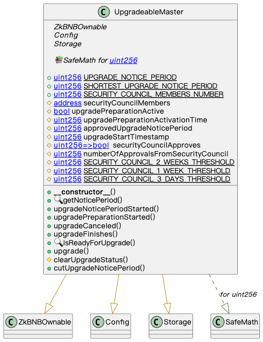

public:: false

- zkBNB
	- [EXTCODEHASH opcode](https://github.com/ethereum/EIPs/blob/master/EIPS/eip-1052.md)
		- 通过 0xc5d2460186f7233c927e7db2dcc703c0e500b653ca82273b7bfad8045d85a470 判断一个地址是否是
-
- # Overview
-
- # ZNS
-
-
- # Token Deposit
-
-
- # NFT Deposit
-
- # Governance
- Governance 主要负责管理资产（Token）、变更 validator、协调升级
- 权限分为两个：
	- networkGovernor： 负责网络管理，可以是 EOA 账户
	- assetGovernance： 负责 token 资产管理，必须是 AssetGovernance 合约
- 资产管理包括：添加和暂停，并提供 `validateAssetAddress` 接口验证资产是否已经添加
- validator 管理通过 `setValidator` 接口可以实现添加或禁用
-
- # Upgradeable
  id:: 65599941-3e6e-4fea-9126-eea11fedada4
  collapsed:: true
	- 以太坊中，智能合约具有不可变性，一旦被部署到链上，没有人可以改变它。
	- ## 什么是智能合约升级？
		- 智能合约升级是一种在保留**存储**和**余额**的同时，而又可以任意更改在地址中执行代码的操作。
	- ## ❗️可升级合约涉及的重要技术点：**delegatecall** 和 **fallback**
		- 合约中常见的两种函数调用：call 和 delegatecall
			- call：当合约使用 call 函数进行外部函数调用时，是在被调用合约的代码环境中执行相应的代码，对调用者没有影响。
			- delegatecall：调用后内置变量 msg 的值不会修改为调用者，但执行环境为调用者的运行环境；
			- {:height 295, :width 716}
		- 函数执行失败，或者没有该函数时，合约会执行 fallback 回调
	- ## 升级模式
		- ### 透明代理：OpenZeppelin
			- {:height 239, :width 685}
			- | msg.sender | owner() | upgradeto() | transfer() |
			  | ---- | ---- | ---- |
			  | 管理员 | 返回 proxy.owner () | 升级代理 | 回退 |
			  | 其他帐户 | 返回 erc20.owner () | 回退 | 转发到 erc20.transfer () |
			- 缺点：Gas 成本高，每次调用实现合约都需要从存储加载 admin 地址，进行判断
		- ### 通用可升级代理（UUPS）：[EIP-1822](https://eips.ethereum.org/EIPS/eip-1822)
			- 将升级逻辑放在实现合约中，而不是在代理本身中
			- 所有实现合约都应继承自基础的 “可代理 proxiable” 合约
			- 缺点：如果实现合约没有实现升级函数，那就永久锁定了版本
	- ## 代理存储
	  collapsed:: true
		- 存储碰撞💥
			- 
		- 非结构化存储
			- 
			- 1 / 2 ** 256
			- [EIP-1967: Proxy Storage Slots (ethereum.org)](https://eips.ethereum.org/EIPS/eip-1967)
			- ```solidity
			  //  Storage position of "target" (actual implementation address: keccak256('eip1967.proxy.implementation') - 1)
			  bytes32 private constant TARGET_POSITION =
			          0x360894a13ba1a3210667c828492db98dca3e2076cc3735a920a3ca505d382bbc;
			          
			  
			  ```
		- 存储布局与追加存储和永久存储的兼容性
	- ## 升级治理
	  collapsed:: true
		- **如何做出升级智能合约的决定**：是由单个受信方立即集中进行还是所有利益相关方通过投票过程进行。
		- 外部所有者账户管理升级
			- 中心化
			- EOA 账户密钥泄露，整个系统面临风险
		- 多签名钱包
		- 时间锁（Timelocks）
			- 目的是，如果用户不同意协议升级，允许用户有时间退出系统
			- ❌ 容易对升级合约进行反向工程，暴露修改的漏洞，从而在时间锁期间被利用
		- 可暂停
			- 可以将系统设置为冻结所有操作，避免造成更大损失
			- 同时也可以抵消时间锁的影响
			- ❌ 用户可能成为 “人质”
		- 逃生舱
			- 即使暂停，该机制也允许用户退出系统
			- ❌ 但是逃生舱机制如果本身有漏洞，可能利用它来耗尽资金
		- 提交 - 披露
			- 提交：公开升级代码给授信的安全顾问
			- 披露：待时间锁结束后，实际发布升级，并立即应用
		- 投票
			- 一般通过 token 完成
	- ## zkBNB 的合约升级方案
	- 5个可升级合约
		- `Governance`
		- `ZkBNBVerifier`
		- `ZNSController`
		- `PublicResolver`
		  id:: 636bbbb0-3ae3-42db-8aca-6a1d48df9b33
		- `ZkBNB`
	- 更新流程
		- addUpgradeable： 在首次部署时将可升级合约添加到管理队列
		- startUpgrade： 启动更新流程，并通知社区
		- startPreparation： 开始准备升级
		- finishUpgrade： 完成升级
		- cancelUpgrade： 取消升级，并恢复升级状态
		- cutUpgradeNoticePeriod： 通过三个安全管理员的审批，可以延长通知周期
	- 实现
	  collapsed:: true
		- 
		- 
		- 
	-
	- UpgradeGatekeeper
		- 是合约升级的入口
		- 权限：
			- 只能由`zkBNB owner` 调用
		- 管理`可升级合约`
			- `可升级合约` 必须被 `Proxy` 合约包装
		- 记录升级流程的各个状态
		- 记录版本号 `versionId`，是一个自增的 uint256，默认是 0
		- 每个阶段依次调用待升级合约的 `UpgradeableMaster` 的回调接口，确保满足升级要求，然后执行升级步骤，完成升级
	- 待办事项
		- 有些单元测试用例偏向于集成测试，测试粒度不够，待完善
		- 有些合约 initializer 函数没有做二次调用限制
		- zkBNB 在 desertMode 模式下，应该限制升级，待完善
		- 补充一个升级 SOP 文档