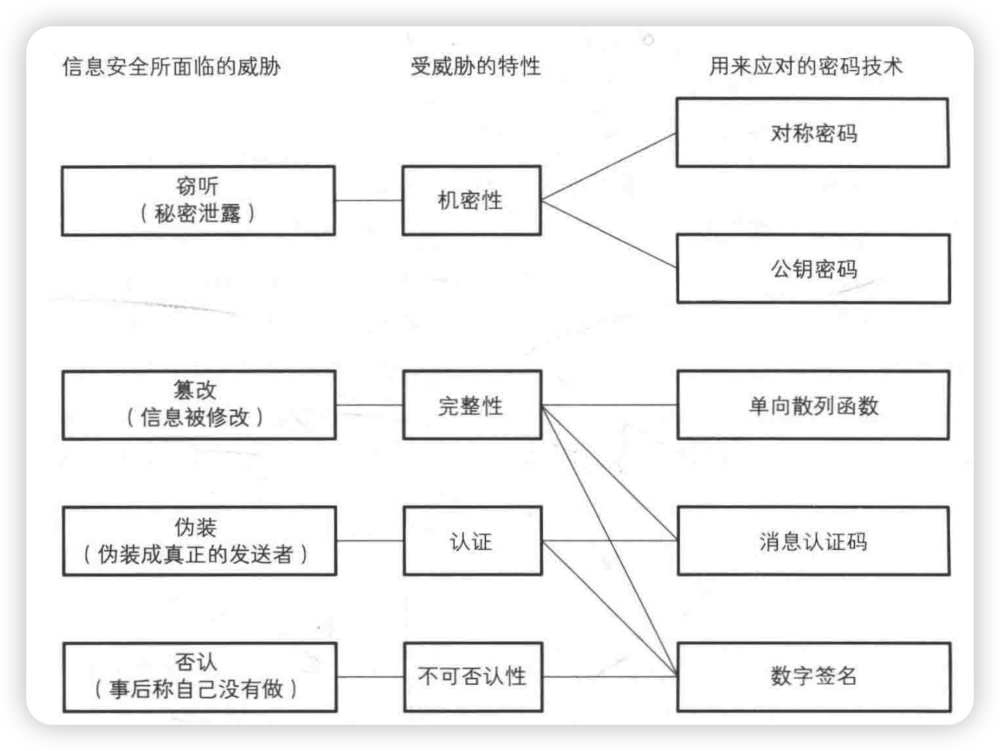
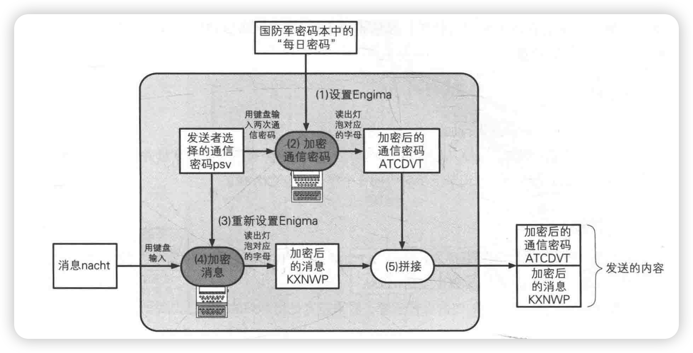
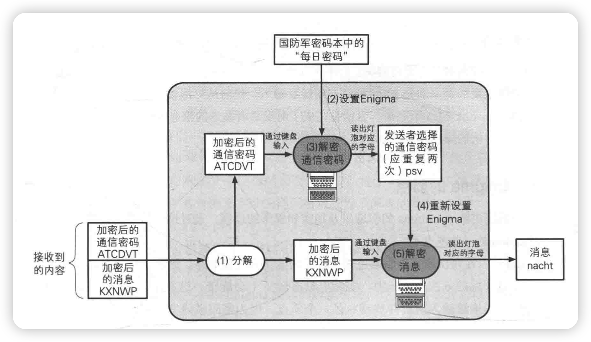

# 密码
	- ## 概览
		- 通过密码（cryptography）技术保证消息机密性
			- 加密和解密的算法加在一起被叫做“密码算法”
			- 根据密钥使用方法分为
				- 对称加密
				- 非对称加密
				- 混合加密
		- 其他密码技术，验证消息完整性，是否被篡改
			- 单向散列函数，又称散列值（hash）、校验和（checksum）、指纹（fingerprint）、消息摘要（message digest）
			- 消息认证码
				- 保证消息完整性和认证
			- 数字签名（digital signature）
				- 不可否认
			- 伪随机数生成器（PRNG）
			- 数字水印
				- 隐藏消息本身
		- 密码学家的工具箱
		  collapsed:: true
			- {:height 524, :width 687}
			-
	- ## 历史上的密码
	  collapsed:: true
		- 凯撒密码
			- 通过字母平移实现
		- 简单替换密码
			- 凯撒密码的高阶版，使用字母表
		- 破解
		  collapsed:: true
			- 暴力破解
				- 将所有可能的密钥全部尝试一遍
			- 密钥空间
				- 所有密钥的集合
				- 空间越大，暴力破解难度越大
			- 频率分析
		- Enigma
			- 二战德国使用的密码机，德语“迷”的意思
			- Enigma 采用每日密钥 + 通信密钥
				- 每日密码用来加密通信密钥，，一般称为密钥加密密钥。经过两次加密提升破解难度
			- 加密
			  collapsed:: true
				- 
				- 设置 Enigma
				  logseq.order-list-type:: number
					- 查阅国防密码本找到每日密码，将三个转子按密码进行排列
				- 加密通信密码
				  logseq.order-list-type:: number
					- 加密人选取三个字母，例如 psv，并用 Enigma 加密两次，并记录输出的密文 ATCDVT
				- 重新设置 Enigma
				  logseq.order-list-type:: number
					- 使用通信密码 psv 重新设置 Enigma的三个转子
				- 加密消息
				  logseq.order-list-type:: number
					- 输入加密消息，并记录输出
				- 拼接
				  logseq.order-list-type:: number
					- 发送者将加密后的通信密码，和加密后的消息进行拼接，并发送内容
			- 解密
			  collapsed:: true
				- 
				- 解密过程和加密过程相反
				- 分解
				  logseq.order-list-type:: number
					- 将密文中的通信密码和加密消息分解
				- 设置 Engima
				  logseq.order-list-type:: number
					- 根据每日密码本初始化 Enigma，同加密过程
				- 解密通信密码
				  logseq.order-list-type:: number
					- 输入加密后的通信密码，得到通行密码明文
				- 重新设置 Engima
				  logseq.order-list-type:: number
					- 按解密后的通信密码重新设置 Engima
				- 解密消息
				  logseq.order-list-type:: number
			- 弱点
				- 加密通信密码时，只有一个转子在旋转
				- 通信密码需要输入两次，破译者可以知道破解之后的密文开始6个字母是重复的
				- 通信密码是人为选定的，可能出现弱密码
				- 必须派发密码本，涉及到*密钥配送问题*
	- ## 对称加密（共享密钥密码）
	  collapsed:: true
		- XOR 异或运算，可以实现加密和解密，如下
		  collapsed:: true
			- 明文A： `01001101001`
			- 密钥B： `10110100010`
			- 密文X： `11111001111` A XOR B
			- 解密：   `01001101101` X XOR B
			- 只要密钥 B 选择合适，无法被猜出来，XOR 就可以是一个高强度密码
		- 一次性密码本
		  collapsed:: true
			- 通过随机数生成和明文一样长度的密钥，通过 XOR 对明文进行加密
			- 维纳 (G.S.Vernam ) 于 1917 年提出，并被香农与 1949 年用数学方法证明无法破解。即使用暴力破解得到明文，也无法判断哪个明文是正确的
			- 为什么没有被使用？
				- 配送：如果发送密钥是安全的，拿么发送明文也就安全，就无需加密
				- 保存：同上
				- 重用：作为密钥的随机序列如果多次使用，一旦密钥泄露就，过去的通讯内容就会被全部破解
				- 同步：如果明文有 100mb，密钥就需要相同长度，并且不许有错位
				- 生成：一次性密码本中的随机数并不能使用计算机的伪随机
		- DES(Data Encryption Stantard)
			- 1977 年美国联邦信息处理标准中采用的一种对称密码，由于可以被暴力破解，已不再适用
			- 明文以 64 bit 进行分组，反复迭代进行加密
				- 
			-
				-
				-
		- 三重 DES
		- AES(Advanced Encryption Stantard)
	- ## 分组密码
		-
		-
-
- # 认证
-
- # 应用
-