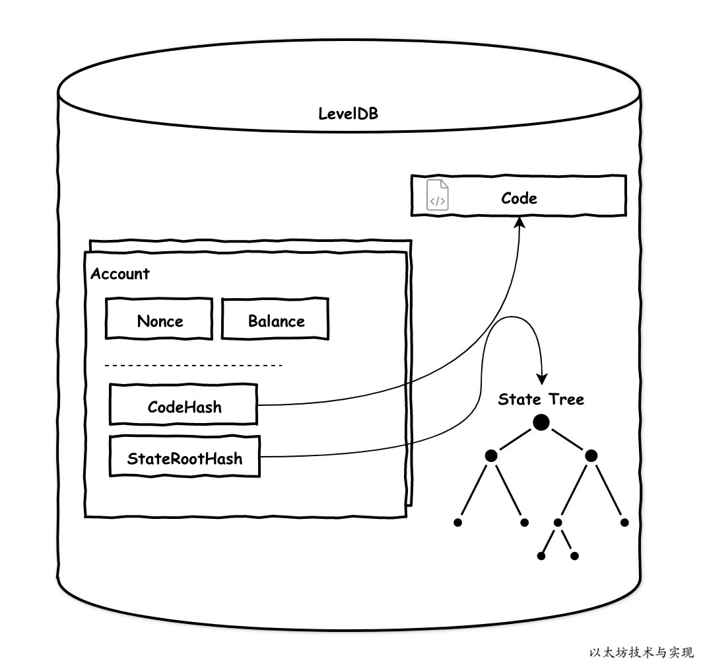
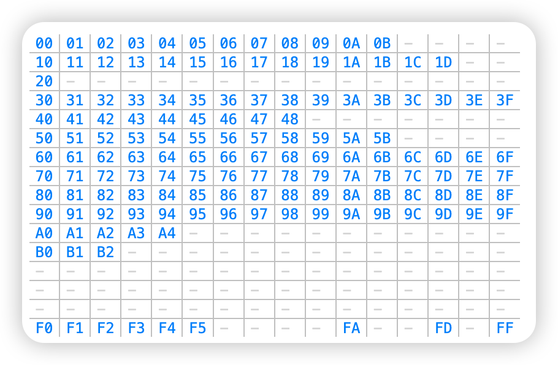
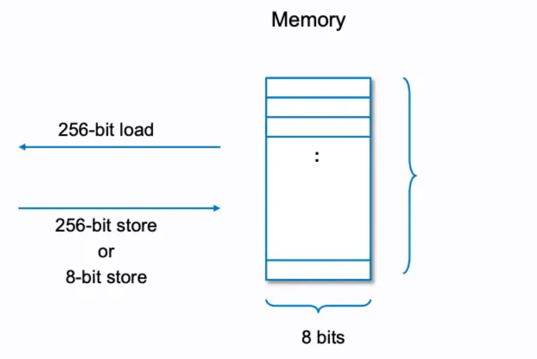

# 以太坊架构
	- ## 基础数据结构
		- ### 基础配置
			- ChainID：EIP155 中实现，用于防止重放攻击
			- HomesteadBlock：硬分叉高度
			- DAOForkBlock：THE DAO 攻击的软分叉，用于锁定 DAO 的资产转移
			- EIP150Block &EIP150Hash：用于解决拒绝服务攻击，在每个新区块中会清除上一个区块的状态缓存
			- ByzantiumBlock：[[以太坊升级]]
		- ### 账户
			- EOA
			- 合约账户：
				- 生成算法
					- CREATE：`Keccak256(rlp([sender,nonce])[12:]`
					- CREATE2：`keccak256( 0xff ++ address ++ salt ++ keccak256(init_code))[12:]`
			- 数据结构：`Nonce` `Balance` `StateRootHash` `CodeHash`
				- {:height 388, :width 302}
			-
		- ### 交易
			- 交易编码以 EIP-2718 提案为准，目前共有4种
				- ```
				  0x00 || rlp([nonce, gasPrice, gasLimit, to, value, data, v, r, s])
				  0x01 || rlp([chain_id, nonce, max_priority_fee_per_gas, max_fee_per_gas, gas_limit, to, value, data, access_list, v, r, s])
				  0x02 || rlp([chain_id, nonce, max_priority_fee_per_gas, max_fee_per_gas, gas_limit, to, value, data, access_list, v, r, s])
				  ```
		- ### 区块
			- parentHash: 上一个区块的 hash
			- sha3Uncles: 叔块集合的 RLP hash
			- miner
			- stateRoot：世界状态树根，由所有账户状态（Account State）按 #默克尔前缀树算法 生成
			- transactionsRoot： 该区块所包含的所有交易的树根
			- receiptRoot：交易回执的树根
			- logsBloom：用于快速定位合约事件
			- difficulty：挖矿难度
			- number：区块序号
			- gasLimit、gasUsed
			- timestamp
			- extraData：矿工自定义字段，一般是矿工网址
			- nonce：PoW 的工作量证明，以太坊升级为 Pos 之后废弃
		- ### 交易回执
			- 共识信息
				- `statue`：1 成功 0 失败
				- `cumulativeGasUsed`：累积消耗的 Gas
				- `logs`：当前交易执行所产生的合约事件列表
				- `bloom`：事件#布隆过滤器 ，用于快速定位某 topic 是否存在于 logs中
			- 交易信息
				- `txHash` `contractAddress` `gasUsed`
			- 区块信息
				- `blockHash` `blockNumber` `transactionIndex`
		- ### Gas
			- [[以太坊 Gas Fee 优化方案]]
	- ## 核心技术
		- ### 签名和校验
			- 签名算法：`secp256k1`
			- 签名过程：
				- ```go
				  func main()  {  
				      dataHash := sha256.Sum256([]byte("ethereum"))
				  
				  	// 准备私钥
				  	pkeyb,err :=hex.DecodeString("289c2857d4598e37fb9647507e47a309d6133539bf21a8b9cb6df88fd5232032")
				  	if err!=nil{
				  		log.Fatalln(err)
				  	}
				  	// 基于secp256k1的私钥
				  	pkey,err:=crypto.ToECDSA(pkeyb)
				  	if err!=nil{
				  		log.Fatalln(err)
				  	}
				  	// 签名
				  	sig,err:= crypto.Sign(dataHash[:],pkey)
				  	if err!=nil{
				  		log.Fatal(err)
				  	}
				  	fmt.Println("sig length:",len(sig))
				  	fmt.Println("sig hex:",hex.EncodeToString(sig))
				  }	
				  
				  //crypto/signature_nocgo.go:60
				  func Sign(hash []byte, prv *ecdsa.PrivateKey) ([]byte, error) {
				  	if len(hash) != 32 {
				  		return nil, fmt.Errorf("hash is required to be exactly 32 bytes (%d)", len(hash))
				  	}
				  	if prv.Curve != btcec.S256() {
				  		return nil, fmt.Errorf("private key curve is not secp256k1")
				  	}
				    
				  	sig, err := btcec.SignCompact(btcec.S256(), (*btcec.PrivateKey)(prv), hash, false)
				  	if err != nil {
				  		return nil, err
				  	}
				  	// Convert to Ethereum signature format with 'recovery id' v at the end.
				  	v := sig[0] - 27
				  	copy(sig, sig[1:])
				  	sig[64] = v
				  	return sig, nil
				  }
				  ```
			- 签名校验
				- EIP155 中 v = recid + chainID* 2 +35
				- 旧算法是 v = recid + 27
		- ### 默克尔压缩前缀树 MPT
			-
			-
- # Solidity → 字节码 → 操作码
  collapsed:: true
	- EVM 操作码占用一个字节，8bit，所以有256 种不同的[操作码](https://ethervm.io/)，目前只使用了140 个
		- {:height 218, :width 475}
	- 编码函数
		- abi.encode (...) returns (bytes)：计算参数的 ABI 编码。每个参数之前包含一个4字节的长度前缀
		- abi.encodePacked (...) returns (bytes)：计算参数的紧密打包编码，参数连续放置，可能导致哈希碰撞💥
		- abi. encodeWithSelector (bytes4 selector, ...) returns (bytes)：计算函数选择器和参数的 ABI 编码。
		- abi.encodeWithSignature (string signature, ...) returns (bytes)：等价于 abi.encodeWithSelector (bytes4 (keccak256 (signature), ...)。
		- abi.encodeCall (function functionPointer, (...)) returns (bytes memory)：使用 tuple 类型参数 ABI 编码调用 functionPointer ()。执行完整的类型检查，确保类型匹配函数签名。结果和 abi.encodeWithSelector (functionPointer.selector, (...)) 一致。
- # 内存
	- TODO [深入 Solidity 数据存储位置 | 登链社区 | 区块链技术社区 (learnblockchain.cn)](https://learnblockchain.cn/article/4864#calldata%E5%BC%95%E7%94%A8)
	- 内存数据结构：
		- 合约中可以存储32byte 或 1byte 的数据块，每次只能读取固定大小（32 或1）的数据块
			- {:height 606, :width 894}
			- 操作内存的操作码有：
				- MSTORE(x,y): 从内存X 开始，存储一个 32 byte 的y值
				- MLOAD(x)：从内存位置 x 开始，加载一个 32 byte 的值到调用栈
				- MSTORE8(x,y)：从内存x 开始，存储一个 1 byte 的 y 值
		- 空闲内存指针
			- 指向一个空闲内存开始的位置，确保智能合约可以追踪内存位置是否写入，防止覆盖变量。
				- `内存指针的位置 + 数据字节大小 = 新空闲内存指针的位置`
				- 内存布局保留的插槽
					- **0x00**：暂存空间，
					- **0x40**：空闲内存指针，第一个可以用于存储的位置，会初始化为 0x80
			-
	-
-
-