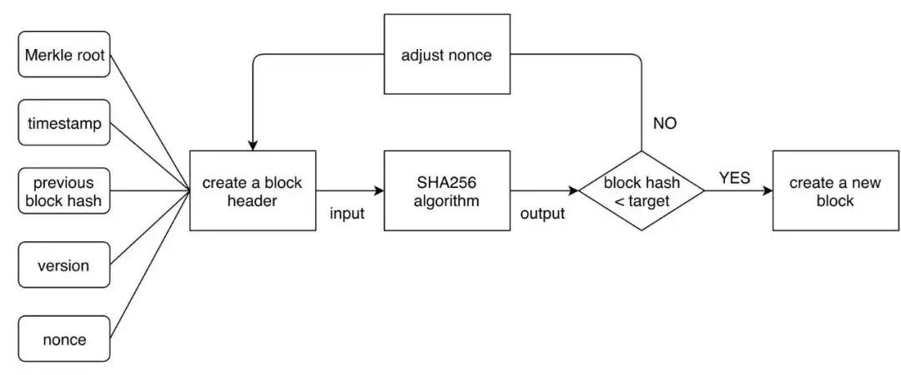
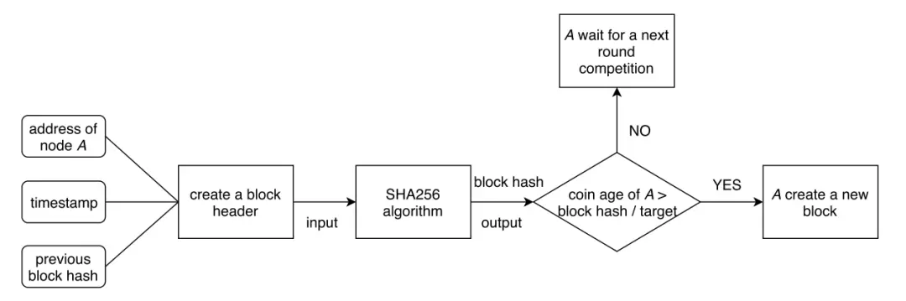

- [What Is Consensus? A Beginner’s Guide (crypto.com)](https://crypto.com/university/consensus-mechanisms-explained)
- # 为什么需要共识协议
	- 区块链本质上是一个**『去中心化账本』**，去中心化意味着这个账本是有由所有节点来维护的。因此需要**共识机制**确保每个节点的账本是**==一致的==**
	- 共识的过程包括：==共识内容== 和 ==共识方式==
- # 有哪些共识协议
	- ## PoW
		- PoW 工作量证明（公式内容） + 最长链原则（共识方式）
			- 对 block + nonce 进行hash，满足哈希值前N 位是0，则创建区块
			- [[以太坊源码]]
		- {:height 165, :width 442}
	- ## PoS
		- 通过只要
		- {:height 155, :width 453}
	- ## PoH
	- ## PoX
-