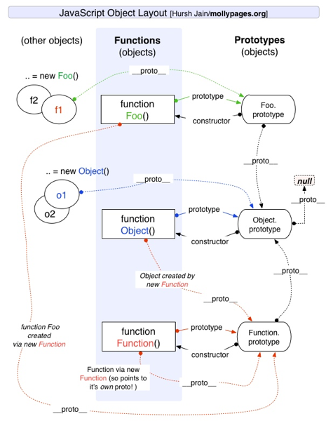
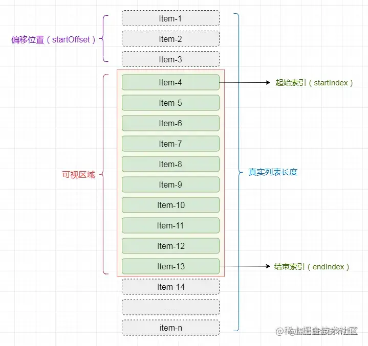

- {{renderer :tocgen2}}
- # JavaScript
  collapsed:: true
	- ## 对象
	  collapsed:: true
		- 原型链
		  collapsed:: true
			- JS 实现继承的基础，每个对象都有一个 `__proto__` 对象，指向另一个对象，而这个对象又具有自己的原型，以此形成一条链式结构
			  collapsed:: true
				- **\_\_proto\_\_**：指向原型对象
				- **prototype**：构造函数指向的原型对象
				- {:height 374, :width 368}
		- new 的过程
		  collapsed:: true
			- 创建一个空对象 obj
			- obj.\_\_proto\_\_ -> Foo.protorype
			- Foo(obj)
			- 返回空对象
		- 基本类型的直接声明和 new 声明的区别
		  collapsed:: true
			- ```js
			  var string1 = 'foo'; // string
			  var myString = new String('male'); // object
			  
			  ```
		- 深拷贝
		  collapsed:: true
			- 循环递归
		- call、apply、bind
		  collapsed:: true
			- call： 参数列表
			- apply： 参数数组
			- bind：返回函数
	- 类型判断
	  collapsed:: true
		- typeof 返回基本类型
		  collapsed:: true
			- object、undefined、string、number...
		- instanceOf 检测构造函数的 prototype 是否出现在某个实例对象的原型链
	- 高阶函数
	  collapsed:: true
		- 对行为（函数）的抽象实体化
		- 将函数作为参数，传入一个函数，或者作为一个返回值
		- 用途：
		  collapsed:: true
			- 函数组合、柯里化（减少调用栈）、延迟执行、事件处理、函数递归、回调函数
	- 防抖和节流
	  collapsed:: true
		- 防抖：多次触发，只执行一次
		  collapsed:: true
			- ```js
			  function debounce(event, wait) {
			    let timer = null;
			    return function (...args) {
			      clearTimeout(timer); // 清除setTimeout，使其回调函数不执行
			      timer = setTimeout(() => {
			        event.apply(this, args);
			      }, wait);
			    };
			  }
			  ```
		- 节流：固定时间窗口只执行一次
		  collapsed:: true
			- ```js
			  function throttle(event, wait) {
			    let pre = 0;
			    return function (...args) {
			      if (new Date() - pre > wait) {
			        // 当 n 秒内不重复执行
			        pre = new Date();
			        event.apply(this, args);
			      }
			    };
			  }
			  ```
- # CSS
- # 浏览器
  collapsed:: true
	- requestAnimationFram 与 requestIdleCallback 的区别
	  collapsed:: true
		- 重绘之前 VS 空闲
		- 高优先级 vs 低优先级
		- 执行动画 VS 不紧急、耗时长的任务
	- 输入 URL之后
	  collapsed:: true
		- 网络：缓存（浏览器缓存、系统缓存、路由器缓存）→ 域名解析 → 建立 TCP 连接 → 发送 HTTP 请求 → 返回 并关闭连接
		- 浏览器渲染：解析 HTML → 构建 DOM 树 → 构建 CSS 规则树 → 构造 Render 树 → 布局（Layout） → 绘制（Painting）
		  collapsed:: true
			- JS 解析，暂时阻断渲染
	- 重绘重排
	  collapsed:: true
		- 重排：重新计算元素几何位置，重新生成布局（开销大）
		- 重绘：改变元素外观
		- 如何避免重排
		  collapsed:: true
			- GPU 加速、集中改变样式、Dom 分片
	- defer 和 async
	  collapsed:: true
		- 相同点：异步加载文件
		- 不同点：D：DOMContentLoaded 之前执行，async：加载和执行并行
	- 盒子模型及 box-sizing
	  collapsed:: true
		- 标准W3C：+ margin
		- IE（怪异）：不加 margin
	- 宏任务和微任务
	  collapsed:: true
		- 异步任务队列，在 EventLoop 过程中，在同步代码执行之后触发
		- 同步代码 →微任务 → 宏任务
- # 框架
  collapsed:: true
	- ## React
	  collapsed:: true
		- ### 组件：
		  collapsed:: true
			- 类组件：生命周期，this 指向实例；行为 + 状态 + 渲染的封装
			- 函数组件：可以用 hooks 封装行为和状态 ，函数中组件负责渲染
		- ### Fiber
		  collapsed:: true
			- Fiber 是 React 16 中新的协调引擎。它的主要目的是使 Virtual DOM 可以进行增量式渲染。
			- 解决的问题：16之前，setState 开始到渲染完成的整个过程是同步的。如果渲染组件复杂，JS 占用主线程事件就长，会导致页面卡顿
			- 作为数据结构
			  collapsed:: true
				- 每个节点都是一个 Fiber，包含`child`、`slibing`、`parent`、`state`、`props`
			- 作为工作单元
			  collapsed:: true
				- 调度的最小单位
			- 更新过程
			  collapsed:: true
				- 协调阶段：
				  collapsed:: true
					- 利用 requestIdleCallback 在浏览器间歇 diif
				- 提交阶段：
				  collapsed:: true
					- 更新 DOM
		- ### 生命周期
		  collapsed:: true
			- ```
			  // 第1阶段 render/reconciliation
			  componentWillMount
			  componentWillReceiveProps
			  shouldComponentUpdate
			  componentWillUpdate
			  
			  // 第2阶段 commit
			  componentDidMount
			  componentDidUpdate
			  componentWillUnmount
			  ```
		- ### setState
		  collapsed:: true
			- 是同步还是异步：
			  collapsed:: true
				- 异步：合成事件、生命周期方法
				- 同步：原生时间、宏任务、微任务
				- 17 之后为了并发渲染默认都是异步
			- 两种参数
			  collapsed:: true
				- 对象：常用
				- 回调：可以获取更新后的 state、
		- ### Hooks
		  collapsed:: true
			- 原理：利用闭包保存状态，使用链表保存一系列 hooks，每个hooks 与 firber 关联
			- 坑：
			  collapsed:: true
				- 不能用if
				- **capture value**，用useCallback
		- ### 服务端渲染
		- ### 性能优化
		  collapsed:: true
			- 列表 key
			- 类组件：shouldComponentUpdate、函数bind、PureComponent
			- 函数式组件：memo、useMemo、useCallback
		- ### 版本更新
		  collapsed:: true
			- 16：fiber、React Fragments、Portal、React Fragments、memo、lazy、hooks
			- 17：平滑迁移
			- 18：并发渲染、root API、setState 自动批处理、
	- ## Flutter
- # 应用
  collapsed:: true
	- ## 算法
	  collapsed:: true
		- 数组乱序
		  collapsed:: true
			- Fisher-Yates 算法
			  collapsed:: true
				- 从数组末尾开始，随机和前面的元素交换，只需要遍历一次就能生成乱序数组
				  collapsed:: true
					- ```javascript
					  function shuffle(arr) {
					      let m = arr.length;
					      while (m > 1){
					          let index = Math.floor(Math.random() * m--);
					          [arr[m] , arr[index]] = [arr[index] , arr[m]]
					      }
					      return arr;
					  }
					  ```
		- 斐波那契数列
		  collapsed:: true
			- 使用递归性能极差，需要用循环或者公式计算
			  collapsed:: true
				- ```javascript
				  function fibonacci(n) {
				    let a = 0, b = 1, temp;
				    if (n === 0) return a;
				    if (n === 1) return b;
				    for (let i= 2; i <= n; i++){
				      temp = a + b;
				      [a, b] = [b, temp]
				    }
				    
				    return b
				  }
				  
				  console.log(fibonacci(30)); // 输出斐波那契数列第 30 位的值
				  
				  ```
	- ## UI
	  collapsed:: true
		- ### 虚拟列表
		  collapsed:: true
			- 常见非完整渲染列表
			  collapsed:: true
				- **懒渲染**：常见的无线滚动，每次只渲染一屏幕的内容，随着用户滚动渲染剩余部分
				- **可视区域渲染**：只渲染可视部分
			- 实现原理
			  collapsed:: true
				- 数组中保存所有数据，只有当滚动位置超出起始索引时，才更新可渲染元素
				- {:height 685, :width 719}
	- ## 性能优化
	  collapsed:: true
		- React 常见优化手段
		- 前端工程化：打包和构建的优化
		- 网络：缓存、CDN、http2 的多路复用
		- 页面构建：重绘和重排
		- 交互：防抖和节流
		- ### 常见指标
		  collapsed:: true
			- First Contentful Paint：白屏时间（第一个文本绘制时间）
			- 首屏时间
			- TTI 第一次可交互时间
			- lighthouse 评分
-