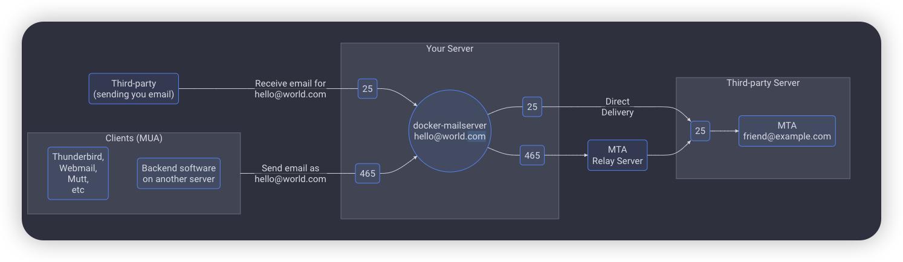

- {{renderer :tocgen2}}
- [使用 Docker Compose 5 分钟 部署 一台邮件服务器 - 「Johny'」PlayGround (treesir.pub)](https://www.treesir.pub/post/docker-deploy-mailserver/)
- # 必备服务
	- Docker
	- mailserver/docker-mailserver 主流邮箱服务镜像，集成了[诸多服务]([docker-mailserver/docker-mailserver: Production-ready fullstack but simple mail server (SMTP, IMAP, LDAP, Antispam, Antivirus, etc.) running inside a container. (github.com)](https://github.com/docker-mailserver/docker-mailserver/#package-included-services))
- # 基础介绍
	- ## 邮件服务器的组成部分
		- MUA(Mail User Agent)
			- 可以从邮件服务器获取邮件，或向邮件服务器发送邮件的客户端程序
		- MTA(Mail Transfer Agent)
			- 从 MUA 的角度来看，MTA 也可实做邮件服务器，是负责电子邮件的路由、传递和传输的软件或服务。MTA 在电子邮件系统中扮演着关键的角色，它负责将发送方的邮件传递到接收方的邮件服务器，从而实现邮件的投递。
		- MDA(Mail Delivery Agent)
			- 负责接收、投递和存储用户接收到的邮件。MDA 的主要任务是将电子邮件从邮件传输代理（MTA）传递给用户的邮箱。
		- ```
		  Sending an email:    MUA ----> MTA ----> (MTA relays) ----> MDA
		  Fetching an email:   MUA <--------------------------------- MDA
		  
		                                     docker-mailserver is here:
		                                                          ┏━━━━━━━┓
		  Sending an email:   MUA ---> MTA ---> (MTA relays) ---> ┫ MTA ╮ ┃
		  Fetching an email:  MUA <------------------------------ ┫ MDA ╯ ┃
		                                                          ┗━━━━━━━┛
		  ```
		- 在docker-mailserver中使用的服务
			- MTA: Postfix
			- MDA: dovecot
			- 还有一些额外的安全服务器和邮件处理程序
				- Rspamd： 垃圾邮件过滤系统
				- fail2ban: 防止暴力破解的董局
				-
	- ## 常见邮件服务端口 & 协议
		- | 协议 | 端口 | 加密端口 | 用途 |
		  | SMTP (Simple Mail Transfer Protocol) | 25 | 587（STARTTLS）或 465（SSL/TLS） | 用于发送电子邮件 |
		  | POP3 (Post Office Protocol version 3) | 110 | 995 | 用于从服务器下载电子邮件到客户端 |
		  | IMAP (Internet Message Access Protocol) |  143 | 993 | 允许客户端查看和操作存储在服务器上的电子邮件 |
		- 应该使用哪个端口
		  collapsed:: true
			- {:height 209, :width 688}
	- ## 常用邮箱服务
		- `sendmail`是一个类 Unix 系统上用于发送邮件的命令行程序，功能强大，更加底层的服务
		- `postfix `是一种邮件传输代理，负责将电子邮件从发送方传递到接收方。它是一个开源的、可靠的 MTA，被广泛用于构建邮件服务器。Postfix 提供了高性能、安全性和易配置的特性。
		- `Dovecot` 既是一个邮件传递代理（MDA），用于接收和投递邮件，又是一个提供 IMAP 和 POP3 服务的服务器，允许用户通过邮件客户端访问他们的邮箱。Dovecot 提供了安全、高性能的邮箱访问服务
		- `SpamAssassin`用于过滤和标记垃圾邮件。它通过检查电子邮件的各个方面（如邮件头、内容、链接等）来评估邮件是否为垃圾邮件。用户可以根据需要调整 SpamAssassin 的规则，以提高或降低过滤的严格程度。
		- `OpenDKIM` 用于实现 DKIM，这是一种通过数字签名验证邮件的技术，确保邮件的完整性和来源可信。邮件服务器使用私钥对邮件进行签名，而接收方服务器使用公钥验证签名。OpenDKIM有助于防范电子邮件的伪造和篡改，提高邮件的可靠性
		- `fail2ban`防止别人暴力破解用户名密码的工具。
	- ## 常见反垃圾邮件技术
	  collapsed:: true
		- SPF（Sender Policy Framework）
			- 用于验证发件人（发件服务器 MTA）身份的技术。发件服务器需要事先添加 DNS 记录，指定发件服务器的 IP，例如：`v=spf1 mx ~all` 允许使用 mx 中指定的服务器发送邮件，除此之外不会强制拒绝（~all)
		- DKIM（DomainKeys Identified Mail）
			- 用于验证邮件身份，在邮件头部添加数字签名，包装邮件的完整性和不可篡改性
			- **将公钥发布到 DNS**：
				- TXT record：mail._domainkey  -> "v=DKIM1; k=rsa; p=MIGfMAR....."
			- **对邮件进行签名**
				- DKIM-Signature: v=1; a=rsa-sha256; d=example.com; s=selector; c=relaxed/simple; .
			- **收件服务器验证签名**
		- DMARC（Domain-based Message Authentication, Reporting and Conformance）
			- 是一种电子邮件认证和报告标准，用于提高电子邮件的真实性、防范伪造和欺诈，并提供有关电子邮件交付的报告。
			- **身份认证**，域名所有者可以指定认证标准，例如只接受通过 SPF 或 DKIM 验证的邮件
			- **报告机制**：允许邮件服务提供商（例如 Gmail、Outlook）向域名所有者发送有关通过其域名发送的邮件的报告
			- **拒绝或标记未通过验证的邮件**：允许域名所有者定义对于未通过验证的邮件的处理策略
			- 例子：`v=DMARC1; p=quarantine; rua=mailto:dmarc@example.com; ruf=mailto:dmarc-forensic@example.com; fo=1; adkim=r; aspf=r;`
		- PTR
			- 域名反向解析
- ## 配置
	- 详见：[Usage - Docker Mailserver (docker-mailserver.github.io)](https://docker-mailserver.github.io/docker-mailserver/edge/usage/)
	- 配置docker-compose
		- 见附件
		- 常见问题
			- 服务器启动后，./docker-data/dms/config/ 路径下的文件没有权限，造成服务无法启动
				- 将docker 的文件映射改为使用 volumes
	- 配置 mailserver.env
	- 配置 SSL
		- letsencrypt
		- 证书验证 [Secure Email (checktls.com)](https://www.checktls.com/)
	- 配置域名解析
		- SPF、DKIM、DMARC、PTR
		- 常用工具
			- https://mxtoolbox.com/ 检查各项域名配置是否正确
- # 附件
	- Docker Compose file
		- ```docker
		  version: "3.4"
		  
		  services:
		    mailserver:
		      image: docker.io/mailserver/docker-mailserver:latest
		      container_name: mail
		      # Provide the FQDN of your mail server here (Your DNS MX record should point to this value)
		      hostname: mail.dnccore.org
		      env_file: mailserver.env
		      # More information about the mail-server ports:
		      # https://docker-mailserver.github.io/docker-mailserver/latest/config/security/understanding-the-ports/
		      # To avoid conflicts with yaml base-60 float, DO NOT remove the quotation marks.
		      ports:
		        - "25:25"
		        - "143:143"
		        - "587:587"
		        - "993:993"
		        - "110:110"
		        - "995:995"
		      volumes:
		        - ./docker-data/dms/mail-data/:/var/mail/
		        - ./docker-data/dms/mail-state/:/var/mail-state/
		        - ./docker-data/dms/mail-logs/:/var/log/mail/
		        - ./docker-data/dms/config/:/tmp/docker-mailserver/
		        - /etc/letsencrypt:/etc/letsencrypt
		        - /etc/localtime:/etc/localtime:ro
		      restart: always
		      stop_grace_period: 1m
		      # Uncomment if using `ENABLE_FAIL2BAN=1`:
		      # cap_add:
		      #   - NET_ADMIN
		      healthcheck:
		        test: "ss --listening --tcp | grep -P 'LISTEN.+:smtp' || exit 1"
		        timeout: 3s
		        retries: 0
		      networks:
		        - dnc
		  
		  # Networks to be created to facilitate communication between containers
		  networks:
		    dnc:
		      driver: bridge
		  ```
		-